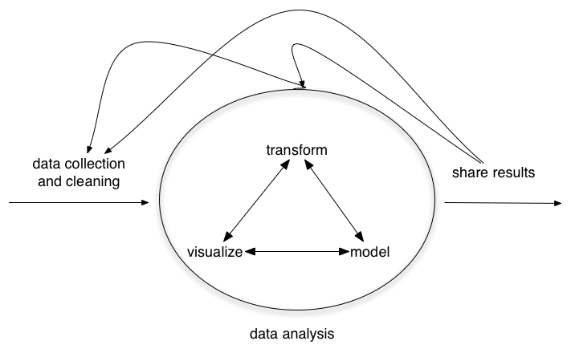
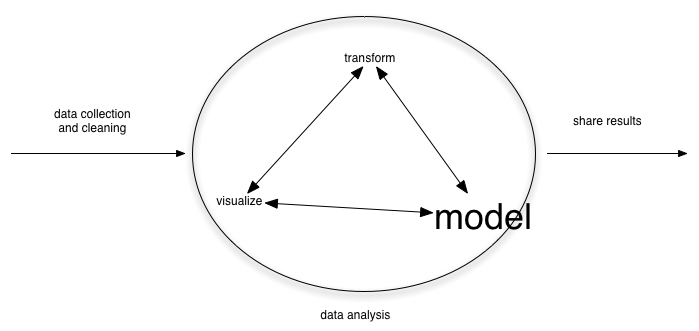
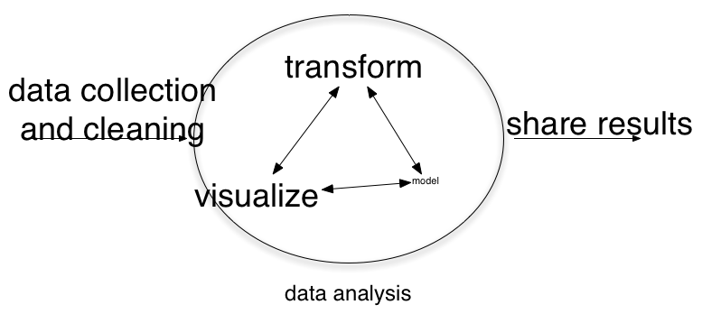
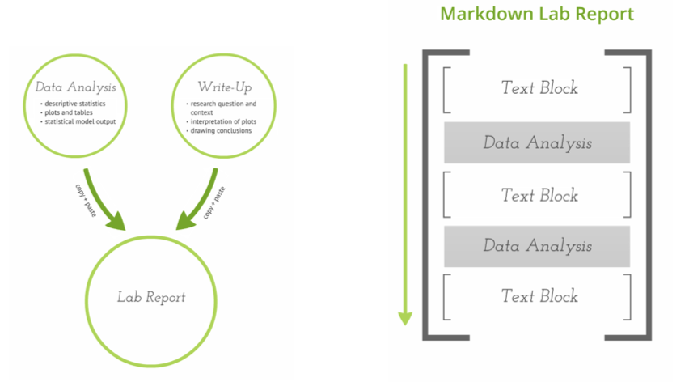
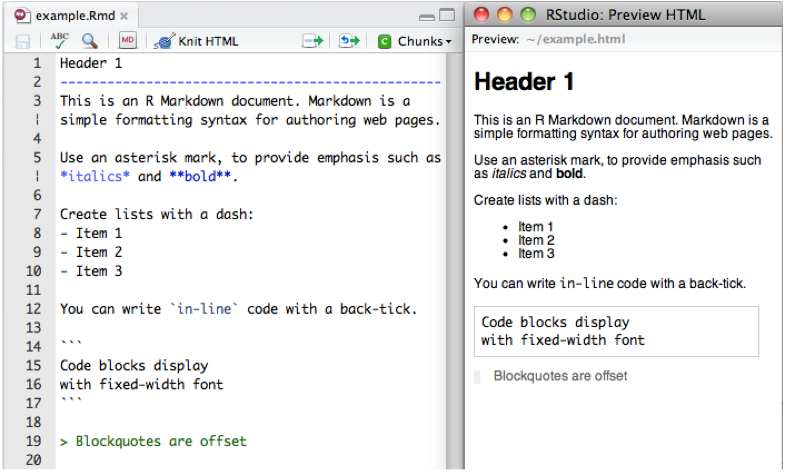
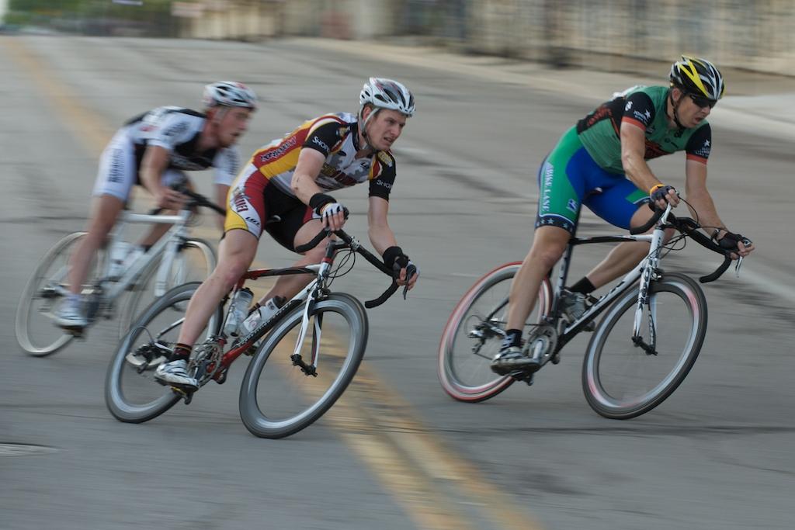

## Goals

After this class, students will be able to:

- Describe the goals for this course 
- Explain why this course might be different from what they expected
- Summarize the expectations we have for them this semester

# What is this course?

## What is this course?

Advanced social data analysis not statistics

## Quantitative research

Inspiration: Hadley Wickham

## Quantitative research

Inspiration: Hadley Wickham

## Quantitative research

Inspiration: Hadley Wickham

## Traditional statistics class

## Actual time spent

## Goals for this course (short-term)

By the end of the semester, you will be able to:

- Conduct, interpret, and communicate results from analysis using multiple regression (including dummy variables and interactions)
- Conduct, interpret, and communicate results from analysis using logistic regression (including dummy variables and interactions)
- Describe the relationship between multiple regression, logistic regression, and then generalized linear model
- Describe the challenges and opportunities for making causal claims from observational data
- Write clean, reusable, and reliable R code
- Feel empowered working with data

## Goals for this course (long-term)

After this course is over, you will be able to:

- Learn new statistics
- Learn new programing

## My goals

I want this course to be:

- modern
- active
- optimized for the long-term, not the short-term

## A note on tone

Regression is:

- the most powerful framework for learning about society
- the worst thing that ever happened to social science; leading us to ask boring questions that we can’t really answer anyway and obsess about the wrong things

# Inspirations for this class

## Inspirations for this class

- data science
- MOOCs (massively open online courses)
- open and reproducible research

## data science 

http://drewconway.com/zia/2013/3/26/the-data-science-venn-diagram

##

http://commons.wikimedia.org/wiki/File:John_Henry-27527.jpg

## 

By the time you are on the job market, computers will be 10x faster than they are now.  The trick is ride this wave rather than getting crushed by it.

In a race against the machine you will lose.

## MOOCs

- use the great educational materials that exist
- curation vs creation
- contribute to the commons

## open and reproducible research

- you will be able to reproduce your own work
- you will be comfortable having your work seen by others
- we will use tools that available to everyone in the world

# tools

## tools

- R
- RStudio
- RMarkdown
- dplyr
- ggplot2
- tidyr
- magritrr
- git
- github

all either free or open-source (or both)

## tools

Better tools mean qualitatively different research, not just the same thing faster

Typewriter vs computer

# Expectations

## 

Three main things you have to do:
 
- prepare for class by reading
- do your weekly homeworks
- finish the replication project

## Homework

Homework will be due every Thursday at midnight (including this Thursday)

You will submit your homework in R Markdown.

## R Markdown vs. what you have done before

[Baumer et al (2014)](http://arxiv.org/abs/1402.1894)

R Markdown uses source - output paradigm (not WYSIWYG)

## What is R Markdown?

[RStudio RMarkdown documentation](http://rmarkdown.rstudio.com/)

How many of you read and write LaTeX? HTML?

## R Markdown

In case you want to learn more, note that this workflow also involves 

- [knitr](http://yihui.name/knitr/): "Elegant, flexible and fast dynamic report generation with R"
- [pandoc](http://johnmacfarlane.net/pandoc/): "If you need to convert files from one markup format into another, pandoc is your swiss-army knife."

## R Markdown

Why R Markdown?

- enables automation
- relatively easy to learn
- gets you into a modern eco-system

# Course style

## This is what the course should feel like

https://www.flickr.com/photos/gasmith/3738239220/

## Collaboration

- Work together.
- Ask your questions on Piazza.
- Use stackoverflow.

But, absolutely positively **don't copy and paste your code**.

## 

What is the right mental model for this class?

- Burger King Model
- Medical Model

Metaphor due to Neil Postman (I think)

## Computing logistics

- How many have laptops? Mac, Windows, Linux?
- How many need accounts on Lotka?
- Collect up everyone's email adddess.
- Ask everyone to sign up for Piazza.

## Class logistics

- Sunday at midnight (or before): Homework posted to github
- Monday, 1:30 - 3:00 meet in Wallace 165
- Monday, 3:00 - 5:00 meet in Stokes Library Computer lab
- Wednesday, 1:30 - 3:00 meet in Wallace 165
- Thursday at midnight, submit homework through github

Because form follows function, the ratio of class time to lab time will vary from week-to-week

## Laptop policy

No laptops, unless we are in the computer lab

- slides will be avaiable
- hard to take notes on technical material on laptop
- creates "second-hand smoke"
- see Shirky: [Why I Just Asked My Students To Put Their Laptops Away](https://medium.com/@cshirky/why-i-just-asked-my-students-to-put-their-laptops-away-7f5f7c50f368)

## Reading

- You *must* read the assigned material *before* class
- I will *not* summarize the reading for you
- In class we will build on the readings

## Honest talk

- Some of you might not think you can learn this material
- Some of you might not want to learn this material
- Learning is hard; we will all struggle in this class

## 

Questions about expectations?

# Goal check

# First lab

## First lab

## 

To the lab

