# Transforming data with dplyr

##

<center></center>

Inspired by Hadley Wickham

## Goals of this lab

At the end of the lab, students will be able to:

- compare and contrast data.frame and tbl (pronounced: "table")
- use the 5 basic verbs in `dplyr`: filter(), select(), arrange(), mutate(), summarise()
- use the group_by command in combination with summarise
- combine the 5 basic verbs using %>%
- use `dplyr` when there is missing data

# Motivating research question

----

"Are soccer referees more likely to give red cards to dark skin toned players than light skin toned players?"

<center>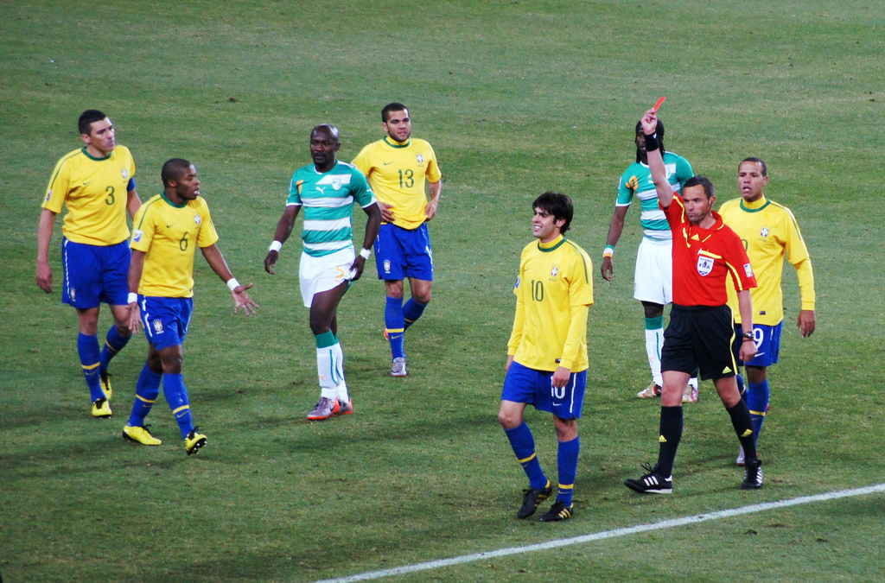</center>

source: https://www.flickr.com/photos/aussiegold/4729935987/

--

- Part of larger project by Center for Open Science (https://osf.io/gvm2z/wiki/): "Crowdstorming research"

<center></center>

- We are going to try to address without regression or statistical tests

## Getting set-up

Load data:
```{r load.data}
load(url("http://www.princeton.edu/~mjs3/soc504_s2015/CrowdstormingDataJuly1st.RData"))
```

Load dplyr:
```{r load.dplyr}
suppressPackageStartupMessages(library(dplyr))
```

## Working with data.frame and tbl

First as a data.frame
```{r print.data.frame}
soccer.data[1:100, ]
```

## Working with data.frame and tbl

Next as a tbl ("table")
```{r data.frame.to.tbl}
tbl_df(soccer.data)
```

## Working with data.frame and tbl
Convert to tbl
```{r data.frame.to.tbl.convert}
soccer.data <- tbl_df(soccer.data)
```

## Data 

```{r preview.data}
select(soccer.data, player.short, games, red.cards, rater1, rater2, ref.num)
```

## Data 

```{r preview.data2}
select(soccer.data, player.short, games, red.cards, rater1, rater2, ref.num) %>%
  filter(player.short=="lionel-messi")
```

## Data structure summary

- Data is stored in a tbl
- One row for each player-referee pair
- "all soccer players (N = 2,053) playing in the first male divisions of England, Germany, France and Spain in the 2012-2013 season and all referees (N = 3,147) that these players played under in their professional career"
- Each column is a variable (note that they are different types)
- More detailed documentation: http://bit.ly/soccer_data_docs

# dplyr overview

## Main idea

simple operations that can be combined flexibly: think Legos!

<center>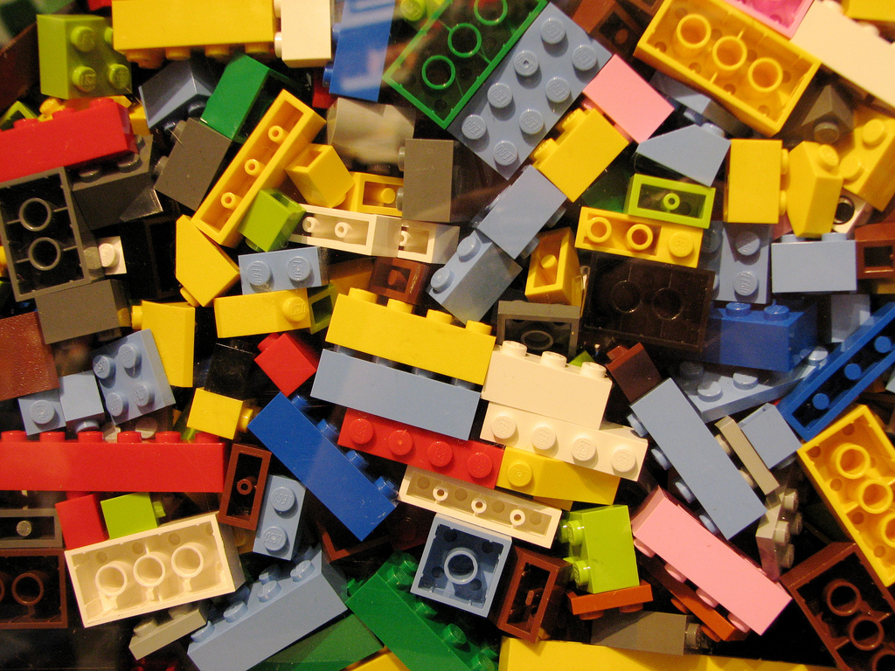</center>

source: https://www.flickr.com/photos/bdesham/2432400623/

## Basic dplyr principles

- data.frame in, data.frame out (this is consistent with the "tidy" philosophy)
- First argument is a data.frame 
- Subsequent arguments say what to do with data.frame
- Never modify in place: you need to save results
- Optimized for both cognitive time (clear syntax) and compuational time (written in C++)

# dplyr: The five verbs

## a simple data.frame

- These examples are all from [Hadley Wickham's talk at useR 2014](https://www.youtube.com/watch?v=8SGif63VW6E)

- Let's start with a simple data.frame

<center>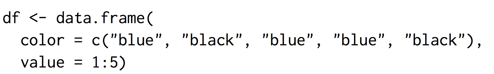</center>

# filter()

## filter() 

<center>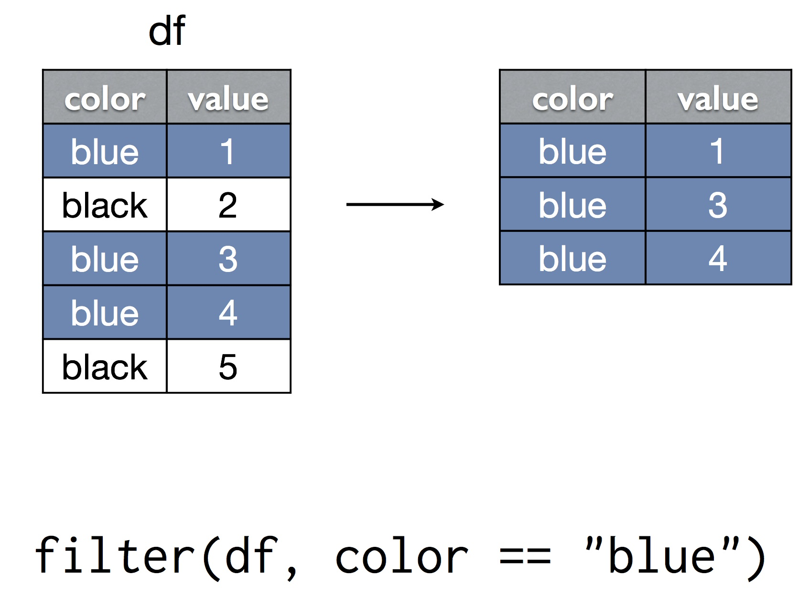</center>

## filter() 

<center>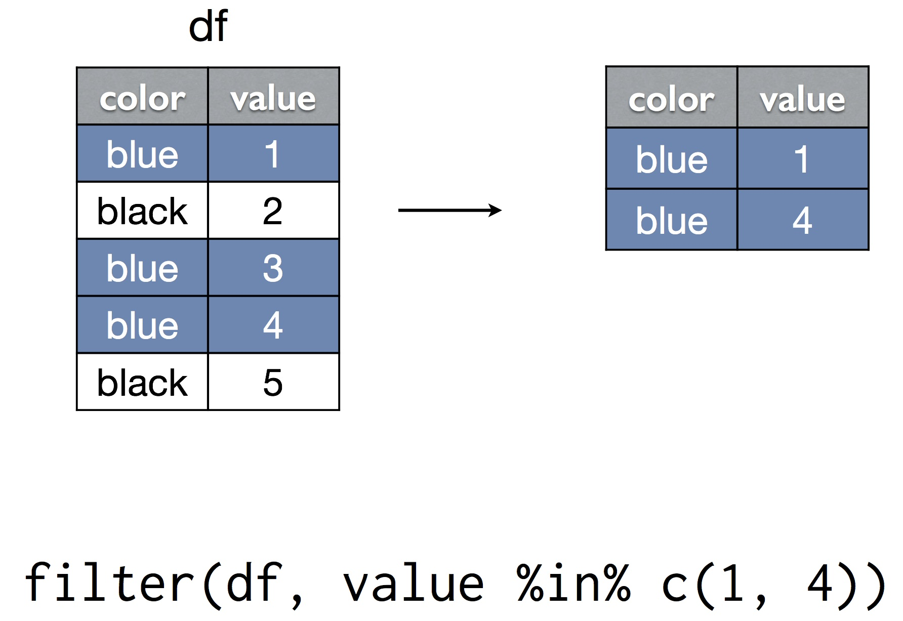</center>

## filter() with soccer data {.build}

Create table with only the games from the Spanish League. Note that this does not change soccer.data

```{r}
filter(soccer.data, league.country=="Spain")
```

## filter() 

<center>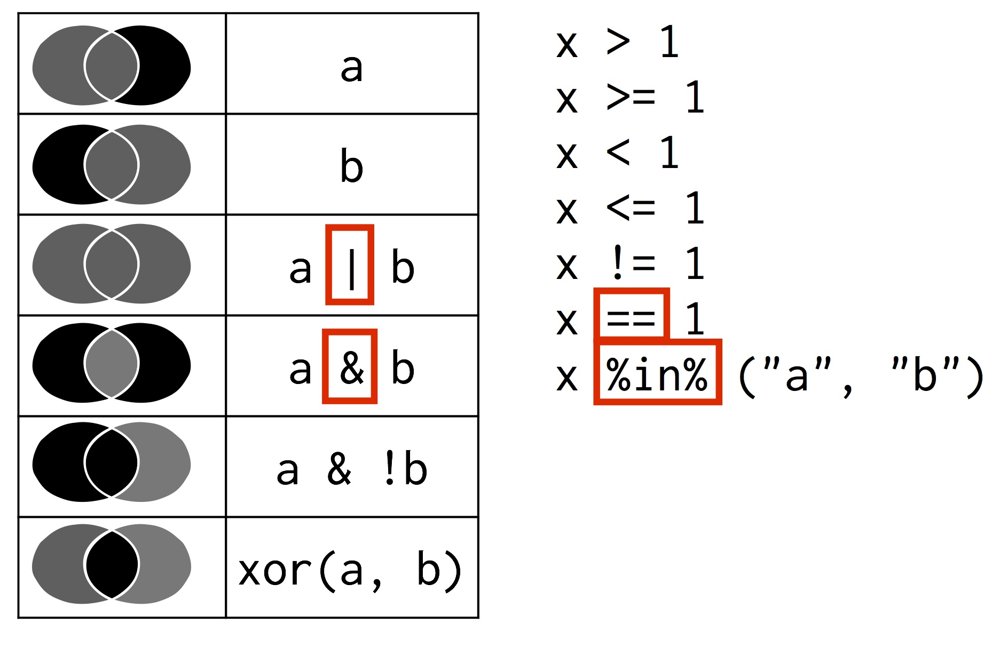</center>


## filter() with soccer data {.build}

Create table with players with one or more red cards.
```{r}
filter(soccer.data, red.cards > 0)
```

add multiple choice problems?

## filter() with soccer data {.build}

MORE PROBLEMS HERE

# select()

## select() 

<center></center>

## select() 

<center>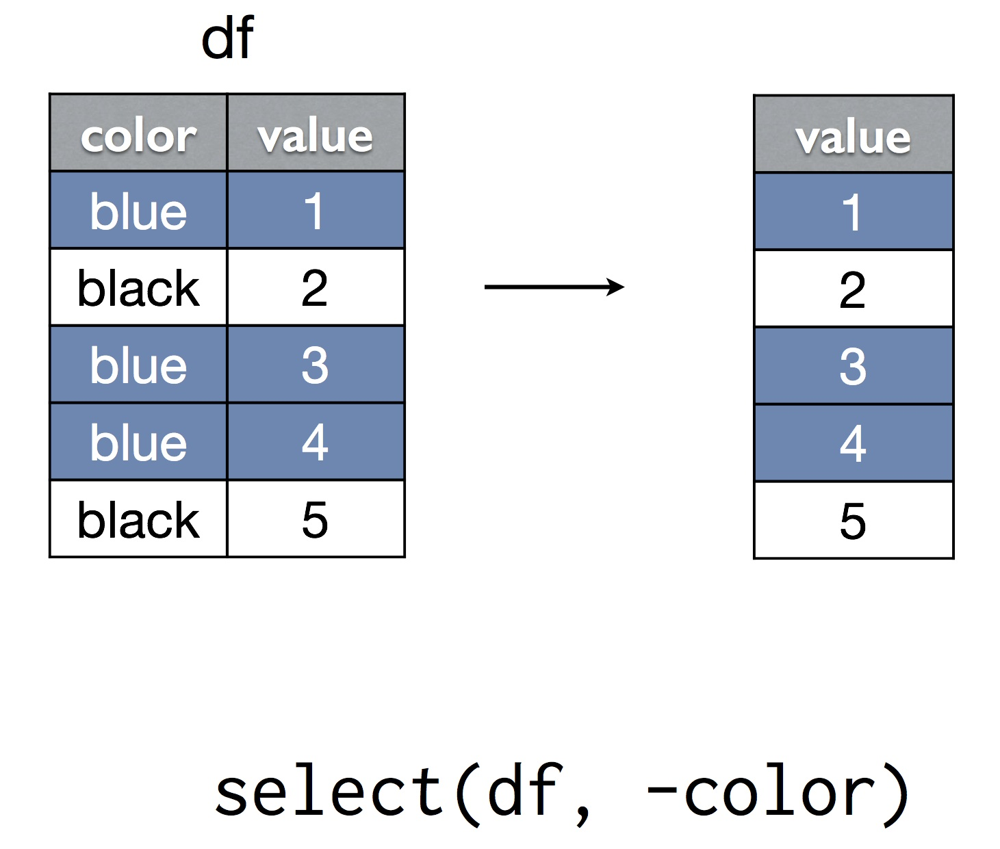</center>

## select() with soccer data {.build}

MORE PROBLEMS HERE

## select() helper functions

Also, lots of helper functions

- starts_with(x): names starts with x
- ends_with(x): names ends in x
- contains(x): selects all variables whose name contains x
- one_of("x", "y", "z"): selects variables provided in a character vector.
- see ?select

## select() with soccer data {.build}

MORE PROBLEMS HERE

# arrange()

## arrange() 

<center>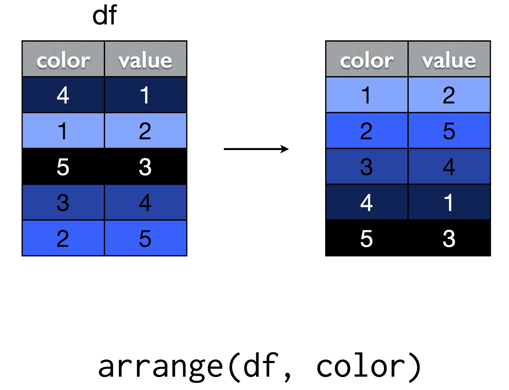</center>

## arrange() 

<center>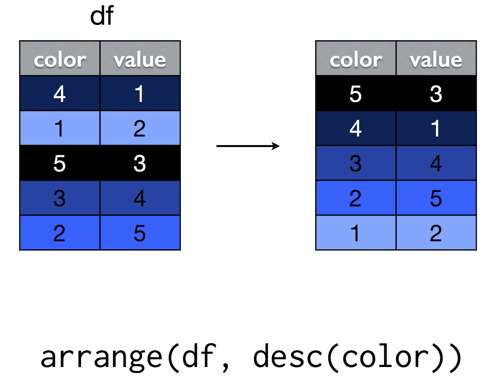</center>

## arrange() with soccer data {.build}

MORE PROBLEMS HERE

# mutate()

## mutate() 

<center>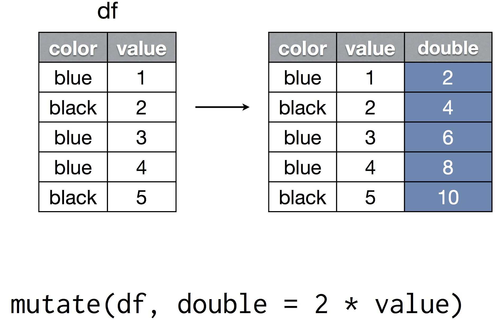</center>

## mutate() 

<center>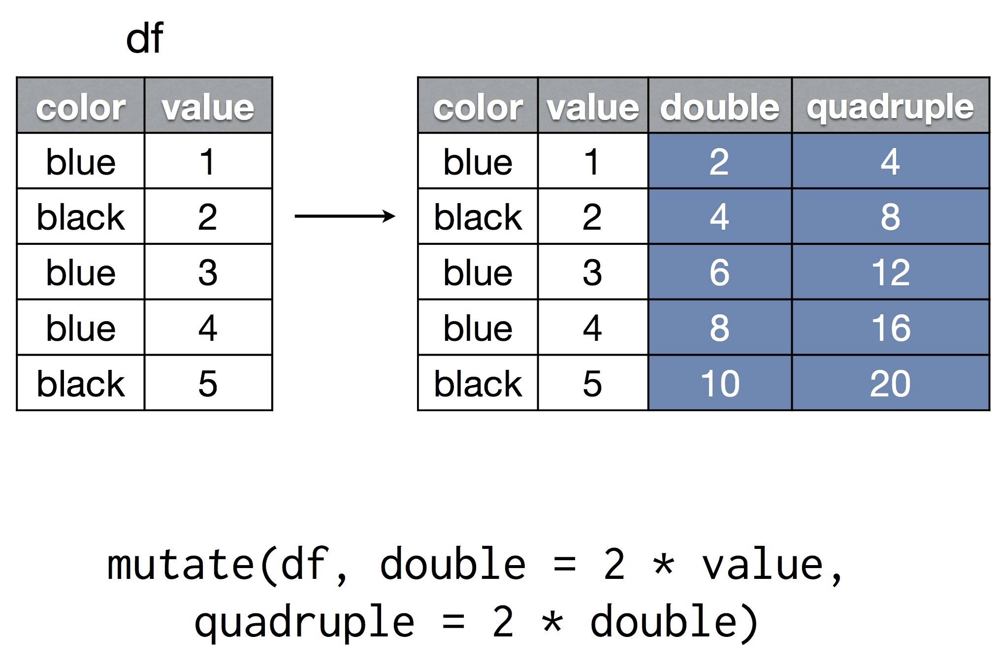</center>

## mutate() with soccer data {.build}

MORE PROBLEMS HERE

One should be to create mean rating

But watch out for missing data!

# summarise()

## summarise()

<center>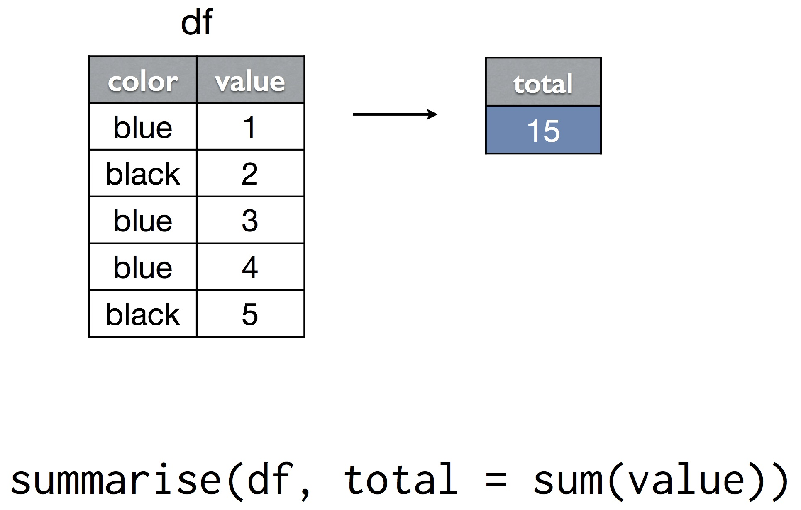</center>

## summarise()

How many red cards are in the dataset?
```{r}
  summarise(soccer.data, total.reds=sum(red.cards))
```

## summarise()

You can use functions that take vector, return number ("Aggregate functions").  Examples:

- sum()
- total()
- mean()
- max()
- n()
- n_distinct()

# summarise() + group_by [much better]

## summarise() + group_by

<center>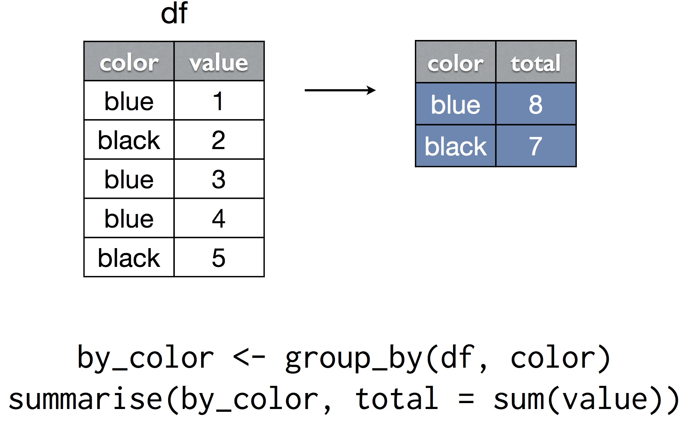</center>

## summarise() + group_by w. soccer data {.build}

How many red cards are there in each league?
```{r}
by_league <- group_by(soccer.data, league.country)
summarise(by_league, total.red=sum(red.cards))
```

## summarise() + group_by w. soccer data {.build}

How many red cards and how many games are there in each league?
```{r}
by_league <- group_by(soccer.data, league.country)
summarise(by_league, total.red=sum(red.cards), total.games=sum(games))
```

## summarise() + group_by w. soccer data {.build}

How many players are there in the dataset?
```{r}
by_player <- group_by(soccer.data, player.short)
summarise(by_player, count=n_distinct(player.short))
```

## summarise() + group_by w. soccer data {.build}

MORE PROBLEMS HERE

# pipes

## pipes

- the 5 verbs can be combined using a the pipe operator %>%
- as you will see, pipes turn out to be awesome!
- prononce %>% as *then*
- For example:
```{r eval=FALSE}
soccer.data %>% 
  group_by(player.short) %>%
  summarise(count=n_distinct(player.short))
```

## pipes with soccer data {.build}

MORE PROBLEMS HERE

## pipes with soccer data { .smaller .build }

Are soccer referees more likely to give red cards to dark skin toned players than light skin toned players?

```{r}
soccer.data %>%
  filter(!(is.na(rater1) | is.na(rater2))) %>%
  mutate(skin.color = (rater1 + rater2) / 2) %>%
  group_by(skin.color) %>% 
  summarise(total.reds = sum(red.cards), total.games = sum(games)) %>%
  mutate(red.rate=total.reds / total.games)
```


## pipes in general {.build}

- can use them everywhere, not just with dplyr
- x %>% f(y) -> f(x, y)
```{r}
c(1, 3, 5, NA) %>% mean(na.rm=TRUE)
```
- part of the [magritrr](http://cran.r-project.org/web/packages/magrittr/vignettes/magrittr.html) package


## But wait there's more. . . 

dplyr() also has:

- support for databases backends
- sql-like join operations
- do() operator so you can use other functions
- rename()
- easy parallelization (probably coming soon)

## Inspirations for this lab

- [Hadley Wickham's talk at useR 2014](http://datascience.la/hadley-wickhams-dplyr-tutorial-at-user-2014-part-1/)
- [Data Camp dplyr course](https://www.datacamp.com/courses/dplyr)

