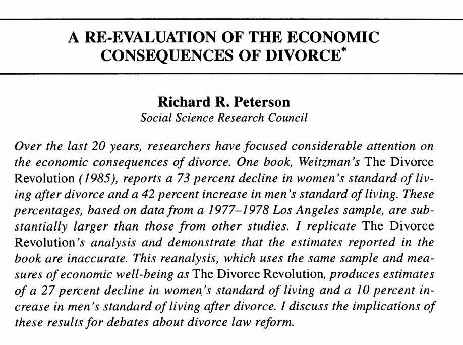
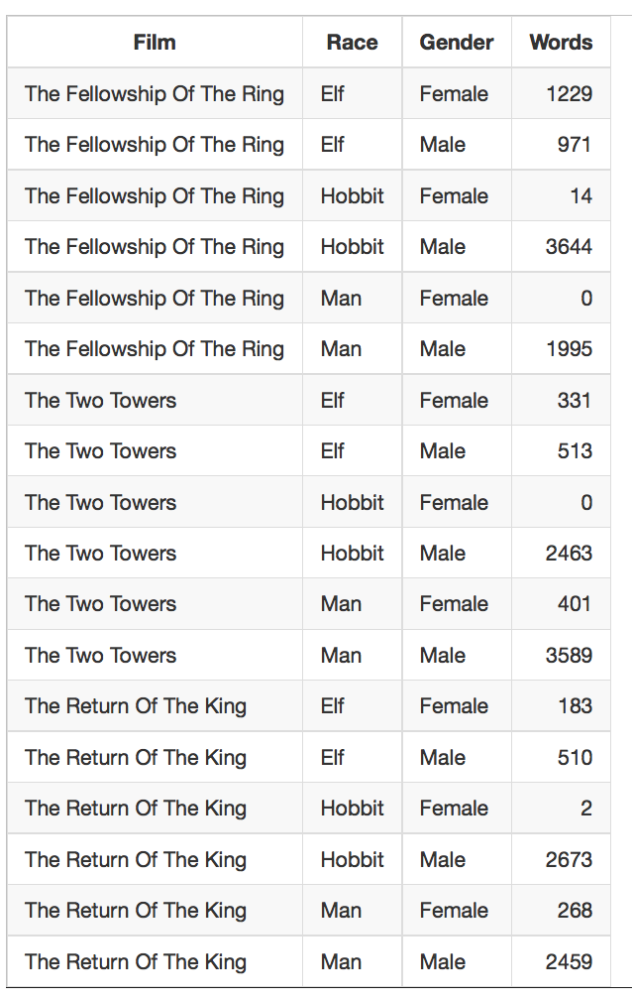

## 

The secret is:

- workflow really important
- there are ideas and techniques that will help you
- after many painful mistakes most researchers figure out some of them

We are going to save you from lots of painful mistakes

## 

After this class, students will be able to:

- explain why a modern workflow will help them
- begin to match data structures to tasks
- begin to recognize good and bad coding style

## The Divorce Revolution


- Change in living standard after divorce
  - for women declines 73% 
  - for men increases 42%

- American Sociological Association Book Award in 1986
- Between 1986 and 1993, cited in 348 social science articles and 250 law review articles
- Between 1986 and 1993, cited in 24 legal cases and *by* the Supreme Court
- Led to changes in divorce law in California

## The Divorce Revolution

<center>

</center>

##  The Divorce Revolution

"First, let me begin with Peterson's implied question: Was this responsible research and did I meet professional standards in analyzing these data?"[Weitzman (1996)](http://www.jstor.org/stable/2096364)

## The Divorce Revolution

". . . .Changes to the original raw data file resulting from this data cleaning process were made by a series of programming statements on a master SPSS system file. *The raw data file that is stored at the Murray Center is the original 'dirty data' file and does not include these cleaning changes*. . . ."[Weitzman (1996)](http://www.jstor.org/stable/2096364)

## 

"Unfortunately, the original cleaned master SPSS system file no longer exists. I assumed it was being copied and reformatted as I moved for job changes and fellowships from the project's original offices in Berkeley to Stanford (in 1979), then to Princeton (in 1983), back to Stanford (in 1984) and then to Harvard (in 1986). With each move, new programmers worked on the files to accommodate different computer systems."[Weitzman (1996)](http://www.jstor.org/stable/2096364)

## 

"Before I left Stanford I instructed my programmers to prepare all my data files for archiving. I know now (but did not know then) that the original master SPSS system file that I used for my book had been lost or damaged at some point and was not included among these files. The SPSS system file that I thought was the master SPSS system file was the result of the merging of many smaller subfiles that had been created for specific analyses. It later became apparent that a programming error had been made, and the subfiles were not ``keyed'' correctly: Not all of the data from each individual respondent were matched on the appropriate case ID number, and data from different respondents were merged under the same case ID. At present it is not possible to disentangle exactly what mismatch occurred for any specific respondent."[Weitzman (1996)](http://www.jstor.org/stable/2096364)

##

"When I could not replicate the analyses in my book with what I had mistakenly assumed was the archived master SPSS system file, I hired an independent consultant, Professor
Angela Aidala from Columbia University, to help me untangle what had happened.  She reviewed all of the project files, documentation, and codebooks, as well as the
available data and programming files to determine a possible computational error in the standard of living statistic. But she could not do this without an accurate data file to work with. We then went back to the original questionnaires and recoded a random sample of about 25 percent of the cases. There were so many discrepancies between the questionnaires and the 'dirty data' raw data file, and between the questionnaires and the mismatched SPSS system file, that we finally abandoned the effort and left a warning to all future researchers *that both files at the Murray Center were so seriously flawed that they could not be used*. It was a very sad, time consuming, and frustrating experience. . ."[Weitzman (1996)](http://www.jstor.org/stable/2096364)

## { .flexbox .vcenter .larger }

"Here's a good rule of thumb: If you are trying to solve a problem, and there are multi-billion dollar firms whose entire business model depends on the solving the same problem, you might want to figure out what the experts do and see if you can't learn something from it." [Gentzkow and Shapiro (2014)]((http://faculty.chicagobooth.edu/matthew.gentzkow/research/CodeAndData.pdf))

## Research pipeline

<center></center>

## 

Gentzkow and Shapiro:

- Automation
- Version control
- Directories
- Keys
- Abstraction
- Documentation
- Management
- Code style


# Automation

## Automation

Automation (as opposed to point-and-click) enables:

- replicability
- efficiency
- creativity

If you find yourself doing the same thing over and over, then you should consider automation. [Any examples?] 

## Automation

In this class, we will use R Markdown = R + Markdown


[Baumer et al (2014)](http://arxiv.org/abs/1402.1894)

R Markdown uses source - output paradigm (not WYSIWYG)

## Automation

Costs-and-benefits of automation

- the short-term
- the long-term

## 

> "The easy way is efficacious and speedy, the hard way arduous and long. But, as the clock ticks, the easy way becomes harder and the hard way becomes easier. And as the calendar records the years, it becomes increasingly evident that the easy way rests hazardously upon shifting sands, whereas the hard way builds solidly a foundation of confidence that cannot be swept away." 

-- Harland Sanders

## Automation

questions about automation

# Version control

## Version control


http://www.phdcomics.com/comics/archive.php?comicid=1531

Do you think they use that system at Google?

## Version control

We will use git and github.  

- Sign up for [Hadley Wickham webinar](http://pages.rstudio.net/Webinar---February-2015_Registration.html)
- Will cover next Wednesday

# Directories

## Directories

- separate directories by function
- separate files into inputs and outputs
- make directories portable

## Directories

<center>

</center>

https://www.flickr.com/photos/rwphoto/3476071029/

## Directories


<center>

</center>

https://www.flickr.com/photos/nohodamon/4825273149/

## Three sensible systems

- [Gentzkow and Shapiro](http://faculty.chicagobooth.edu/matthew.gentzkow/research/CodeAndData.pdf)
- [ProjectTemplate](http://projecttemplate.net/) by John Miles White and others
- [Teaching Integrity in Empirical Research](http://www.haverford.edu/TIER/) by Richard Ball and Norm Medeiros

# Keys, databases, and data structures

## Keys, databases, and data structures

Main points:

- There are many ways to store the same data; some are better than others 
- The way you organize your data for storage and analysis might be different
- Store data normalized and then de-normalize for analysis
- Like grammer, you can break these rules, but you should do so consciously

## Keys and databases

Database design is a huge field.  For us, the most important ideas is *third normal form* (Codd)

We will build up some concepts so that you can understand this idea, then we will return to the soccer data from lab.  You will see it differently.

## Keys

*Keys* are really important:

- primary keys uniquely define rows
- primary keys can be simple (one column) or compound (more than one column)
- primary keys must be defined for each row

## Keys { .build }

Question: If we were going to make a database of information about students in this class, is first_name a good primary key?

Answer: No, might not be unique.

## Keys { .build }

Question: If we were going to make a database of information about students in this class, is first.name and last.name a good primary key?

Answer: Better, but what if we want to add to the database over time.

## Keys { .build }

Question: If we were going to make a database of information about students in this class, is Princeton ID number a good primary key?

Answer: Yes, unique and defined for each person (unless, we had auditors).

## Normal forms

Two big picture goals:

- each entity should have its own table
- "each nonkey should provide a fact about the key, the whole key, and nothing but the key" [Kent (1983)](http://www.bkent.net/Doc/simple5.htm)

Intuition and examples from:

- Murrell (2009) ["Introduction to Data Technologies"](https://www.stat.auckland.ac.nz/~paul/ItDT/HTML/node42.html) [OA]
- Kent (1983) ["A Simple Guide to Five Normal Forms in Relational Database Theory"](http://www.bkent.net/Doc/simple5.htm) [OA]

## First normal form { .build }

- the columns in a table must be atomic
- there should be no duplicative columns
- every table must have a primary key

book_table ( title [PK], authors)

title                          authors
-----------------------------  -----------------------
Das Kapital                    Karl Marx
The Communist Manefesto        Karl Marx, Friedrich Engels 

## First normal form { .build }

- the columns in a table must be atomic
- there should be no duplicative columns
- every table must have a primary key

book_table ( title [PK], author1, author2)

title                          author1      author2
-----------------------------  -----------  -----------
Das Kapital                    Karl Marx    NULL
The Communist Manesto          Karl Marx    Friedrich Engels

## First normal form { .build }

- the columns in a table must be atomic
- there should be no duplicative columns
- every table must have a primary key

book_table (title [PK], author)

title                          author
-----------------------------  ----------- 
Das Kapital                    Karl Marx 
The Communist Manefesto        Karl Marx  
The Communist Manefesto        Friedrich Engels

## First normal form { .build }

- the columns in a table must be atomic
- there should be no duplicative columns
- every table must have a primary key

book_table (ISBN [PK], title, author [PK])

ISBN            title                              author     
--------------  -----------------------------  ---------------------
9783520064073     Das Kaptial                       Karl Marx
9789875742925     The Communist Manifesto           Karl Marx
9789875742925     The Communist Manifesto           Friedrich Engels

Note that even though this is first normal form, it is not a great solution so let's keep going

## Second normal form { .build }

- a table must be in first normal form
- all columns in the table must relate to the entire primary key

Formalizes the idea that there should be a table for each entity in the data set 

##  Second normal form { .build }

- a table must be in first normal form
- all columns in the table must relate to the entire primary key

prof_table (last name [PK], university [PK], state)

Last Name       University     State
------------   ------------   -------------
Metron          Columbia        NY
Parson          Harvard         MA
Park            Chicago         IL

##  Second normal form { .build .smaller }

- a table must be in first normal form
- all columns in the table must relate to the entire primary key

prof_table (last name [PK], university [PK])

Last Name       University    
------------   ------------   
Metron          Columbia      
Parson          Harvard       
Park            Chicago 


university_table(university [PK], state [PK])

University     State
------------   -------------
Columbia        NY
Harvard         MA
Chicago         IL


##  Third normal form { .build }

- a table must be in second normal form 
- all columns in the table must relate only to the primary key (not to each other). 

book_table (ISBN [PK], title, publisher, country)

ISBN        title                           publisher        country
----------  -----------------------------  -------------  -----------
0374527253  Sidewalk                        FSG              USA    
0836827848  The Purchase of Intimacy        PUP              USA
0908783116  The Twenty-First Century Firm   PUP              USA

Solution

- book table 
- publisher table

## Third normal form { .build }

- a table must be in second normal form 
- all columns in the table must relate only to the primary key (not to each other). 

player_table (ID [PK], name, height, weight, BMI)

ID       name             height     weight     BMI
---  ------------------ ---------- ---------- ------
1       Russell Wilson    1.8         93        28.7
2       Marshon Lynch     1.8         98        30.2
3       Tom Brady         1.93        102       27.4

Solution:

- don't store BMI (it a derived from height and weight)

## Database ideas applied to soccer data

Recall that in lab, we used [data from Center for Open Science on skin tone and red cards in soccer](https://osf.io/gvm2z/wiki/home/)

Let's think about the data differntly:

- each entity should have its own table
- "each nonkey should provide a fact about the key, the whole key, and nothing but the key" [Kent (1983)](http://www.bkent.net/Doc/simple5.htm)
Let's use this rule to think about the data differently:

## Database ideas applied to soccer data { .build }

```{r echo=FALSE}
load(url("http://www.princeton.edu/~mjs3/soc504_s2015/CrowdstormingDataJuly1st.RData"))
suppressPackageStartupMessages(library(dplyr))
soccer.data <- tbl_df(soccer.data)
```

```{r}
glimpse(soccer.data)
```

Activity: List the different entities.

## Database ideas applied to soccer data { .build }

```{r}
names(soccer.data)
```

## Database ideas applied to soccer data { .build }

Question: What are the different entities?

Answer: It depends.  But here are some good candidates:

- players
- referees
- referees country
- leagues
- games

## Soccer data { .build}

Research questions:

1. Are soccer referees more likely to give red cards to dark skin toned players than light skin toned players?
2. Are soccer referees from countries high in skin-tone prejudice more likely to award red cards to dark skin toned players?

Q: What is the primary key in a table to answer question 1?

A: It depends.  Good candidate is player.  Could also be skin color.

## Soccer data { .build }

Research questions:

1. Are soccer referees more likely to give red cards to dark skin toned players than light skin toned players?
2. Are soccer referees from countries high in skin-tone prejudice more likely to award red cards to dark skin toned players?

Q: What is the primary key in a table to answer question 2?

A: It depends.  Good candidate is composite key with player and referee.

## Recap

Databases in third normal form follow the DRY principle: [Don't repeat yourself](http://en.wikipedia.org/wiki/Don%27t_repeat_yourself)

- easy to understand (self-documenting)
- easy to update
- never gets out of sync

## Recap, [Murrell (2009)](https://www.stat.auckland.ac.nz/~paul/ItDT/HTML/node42.html) { .smaller }

- A database consists of one or more tables. Each column of a database table contains only one type of information, corresponding to one variable from a data set.

- A primary key uniquely identifies each row of a table. A primary key is a column in a table with a different value on every row.

- A foreign key relates one table to another within a database. A foreign key is a column in a table that refers to the values in the primary key of another table.

- A database should be designed so that information about different entities resides in separate tables.

- Normalization is a way to produce a good database design.

- Databases can handle large data sets and data sets with a complex structure, but databases require specific software and a certain level of expertise. 

## Questions

Questions about databases?

1. Why don't people do this more?

I don't know, but my guess is that they don't know how to do joins in a reliable way so they are afraid.

## Tidy data


"a philosophy of data" that underlies many of our tools (e.g, dplyr)

[Wickham (2014)](http://www.jstatsoft.org/v59/i10/paper)

## Tidy data

In tidy data:

- each variable forms a column
- each observation forms of a row
- each type of observation forms a table 

## Tidy data (example)

Tidy is not what the data looks like to your eye, it is what the data looks like to the computer

Store data for computers not people

## Tidy data (example) { .build }


Not tidy. 

Three variables are religion, income, frequency.

## Tidy data (example)


## Tidy data { .build }

Example from [Jenny Bryan](https://github.com/datacarpentry/datacarpentry/blob/master/lessons/tidy-data/01-intro.md)

<center></center>

Q: Is this data tidy?

A: No.


## Tidy data

<center></center>

- What's the total number of words spoken by male hobbits?
- Does a certain Race dominate a movie? Does the dominant Race differ across the movies?
- How well does your approach scale if there were many more movies or if I provided you with updated data that includes all the Races (e.g. dwarves, orcs, etc.)?

## Tidy data

<center></center>

## Tidy data

Let's work with this data some . . .

```{r}
lotr <- read.csv("data/lotr_tidy.csv", header=TRUE)
suppressPackageStartupMessages(library(dplyr))
suppressPackageStartupMessages(library(ggplot2))
```

## Tidy data

What's the total number of words spoken by male hobbits?

```{r}
lotr %>% 
  filter(Gender=="Male", Race=="Hobbit") %>%
  summarise(total=sum(Words))
```

How well does your approach scale if there were many more movies or if I provided you with updated data that includes all the Races (e.g. dwarves, orcs, etc.)?

## Tidy data { .build .smaller }

What's the total number of words spoken by male hobbits?

```{r}
lotr %>% 
  group_by(Gender, Race) %>% 
  summarise(total=sum(Words))
```

How well does your approach scale if there were many more movies or if I provided you with updated data that includes all the Races (e.g. dwarves, orcs, etc.)?

## Tidy data 

Does a certain Race dominate a movie? Does the dominant Race differ across the movies?

## Tidy data 

```{r}
words_by_film_race <- lotr %>% 
  group_by(Film, Race) %>% 
  summarise(Total.Words = sum(Words))
words_by_film_race
```

## Tidy data { .smaller }

```{r}
p <- ggplot(words_by_film_race,
            aes(x = Film, y = Total.Words, fill = Race))
p + geom_bar(stat = "identity", position = "dodge") +
  coord_flip() + guides(fill = guide_legend(reverse=TRUE))
```

How well does your approach scale if there were many more movies or if I provided you with updated data that includes all the Races (e.g. dwarves, orcs, etc.)?

Note that we will learn to make plots like this on Monday.

## Tidy data 

Tall skinny data looks bad to the eye, but seems to work better for computers

## Tidy data

<center></center>

- What's the total number of words spoken by male hobbits?
- Does a certain Race dominate a movie? Does the dominant Race differ across the movies?
- How well does your approach scale if there were many more movies or if I provided you with updated data that includes all the Races (e.g. dwarves, orcs, etc.)?

## Summary

- How you store your data matters
- Keep normalized as long as possible, then modify (merge, reshape) for analysis 
- dplyr has great merge functions ("[two table-verbs](http://cran.r-project.org/web/packages/dplyr/vignettes/two-table.html)")
- [tidyr](http://cran.r-project.org/web/packages/tidyr/index.html) and [reshape2](http://cran.r-project.org/web/packages/reshape2/index.html) have great reshaping functions

## Questions

Questions about Keys, databases, and data structure

# Abstraction

## 

abstraction: "turning the specific instances of something into a general-purpose tool"

More concretely

- don't copy and paste
- don't repeat yourself
- write reusable code

Abstraction takes practice, and we will work on it all semester

##

Three techniques we will use to promote abstraction

- loops
- functions
- refactoring

## loops

Loops help you do the same thing over and over

## loops { .build }

```{r eval=FALSE}
model.us <- lm(us$income ~ us$edu)
```

```{r eval=FALSE}
model.us <- lm(us$income ~ us$edu)
model.uk <- lm(uk$income ~ uk$edu)
```

 . . . 
 
```{r eval=FALSE}
model.us <- lm(us$income ~ us$edu)
model.uk <- lm(uk$income ~ uk$edu)
model.de <- lm(uk$income ~ de$edu)
model.fr <- lm(fr$income ~ fr$edu)
model.jp <- lm(jp$income ~ jp$edu)
model.cn <- lm(cn$income ~ cn$edu)
```

- Who sees the mistake? 
- What if you want to change the model?

## loops { .build }

```{r eval=FALSE}
countries <- c("us", "uk", "de", "fr", "jp", "cn")
for (country.code in countries) {
  data.this.country <- filter(all.data, country==country.code)
  model[[country.code]] <- lm(data.this.country$income ~ data.this.country$edu)
}
```

- every country gets same regression
- easy to change

## loops

Questions about loops?

## functions

functions take inputs and return outputs

```{r eval=FALSE}
  total <- sum(c(1, 2, 3))
}
```

functions are like you building your own tools

## functions 

*all* complicated pieces of software use functions

- allows for tests
- allows for seperation of concerns
- allows for easy reuse

## functions

<center></center>

```{r eval=FALSE}
  analytic.data <- run.processing.code(measured.data)
}
```

## functions

Questions about functions?


## refactoring

refactoring is a fancy name for re-writing your code.

Often you don't know the right abstractions at the beginning.

It is almost always worth it to take a few hours and rewrite your code with the right abstractions.  This happens *all the time* in real projects.

## abstraction

- loops
- functions
- refactoring

Questions about abstraction?

# Documentation
  
##

If you want to be able to reproduce your results 10 years from now, you need to write documentation.

- Write self-documenting code.
- Your code should be human-readable.
- Choose variable names that make sense.
- Your code should be clear to someone else.  And, that someone else could be you.
- sometimes the best way to document is to refactor

##

Questions about documentation?

# Management

##

Every large software project uses task-management software.

Mangagemnt and collaboration are related: we're going to use git and github.

# Code Style

## Code style { .build }

Do you think that some people write better English prose than others?

Have you struggled to write beautiful prose over many years?

In this class, we are going to struggle to write beautiful code.

## Code style { .build }

Why spend time on write beautiful code?

- fewer errors
- easier to change
- better for collaboration
- reproducible
- open

## Code style { .build }

- Our first step to writing beautiful code is to pick a set of code conventions.

- All code in this class will follow [Google's R Style Guide](https://google-styleguide.googlecode.com/svn/trunk/Rguide.xml).  These are the rules that they developed and use in Google so that they can write beautiful code.

- Google's success criteria: "Any programmer should be able to instantly understand structure of any code"

- For more on Google's R Style Guide see [Andy Chen's presenation at useR 2014](http://static.googleusercontent.com/media/research.google.com/en/us/pubs/archive/42577.pdf).

## Code style

File Names: File names should end in .R and, of course, be meaningful. 

#. predict_ad_revenue.R
#. foo.R

## Code style

Identifiers: Don't use underscores ( _ ) or hyphens ( - ) in identifiers. Identifiers should be named according to the following conventions. The preferred form for variable names is all lower case letters and words separated with dots (`variable.name`), but variableName is also accepted; function names have initial capital letters and no dots (`FunctionName`); constants are named like functions but with an initial k.

Variable names:

#. avg.clicks
#. avg_Clicks
#. ac

## Code style

Identifiers: Don't use underscores ( _ ) or hyphens ( - ) in identifiers. Identifiers should be named according to the following conventions. The preferred form for variable names is all lower case letters and words separated with dots (`variable.name`), but variableName is also accepted; function names have initial capital letters and no dots (`FunctionName`); constants are named like functions but with an initial k.

Function names:

#. CalculateAvgClicks
#. calculate_avg_clicks 
#.  calculateAvgClicks

## Code style

Code style is something we will work on throughout the semester.  Getting the code conventions right is just the first step.

Just like learning to write, learning to code is hard, important, and possible.

## Code style

For more see, [Google's R Style Guide](https://google-styleguide.googlecode.com/svn/trunk/Rguide.xml)

## Wrap-up

Gentzkow and Shapiro:

- Automation
- Version control
- Directories
- Keys
- Abstraction
- Documentation
- Management
- Code style

Questions and comments?

##

<center></center>


http://commons.wikimedia.org/wiki/File:Professor_Lucifer_Butts.gif

##

<center></center>

http://commons.wikimedia.org/wiki/File:Tour_Eiffel_Wikimedia_Commons.jpg

## Wrap-up

Goal check

## Wrap-up

Motivation and summary of material for next class
