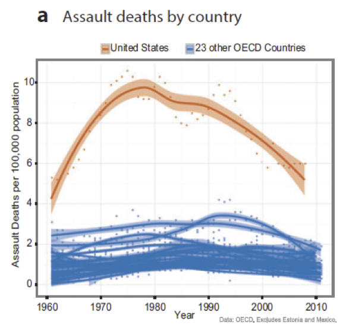
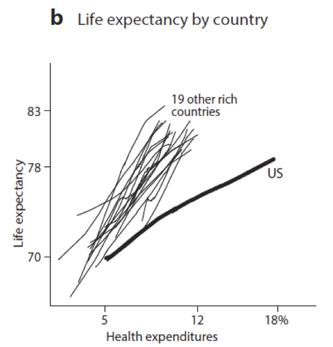
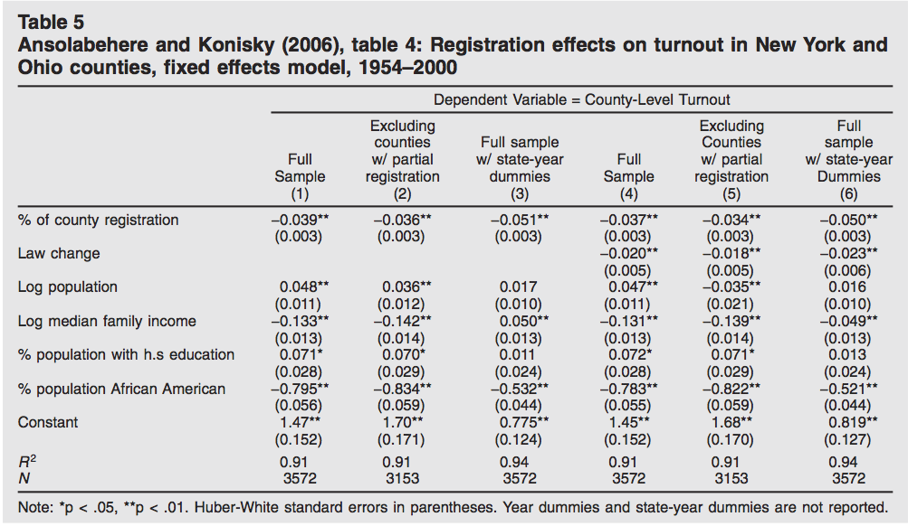

##


## 

After this class students will be able to:

- distinguish between the two main purposes of visualizations
- explain the layered grammer of graphics
- be excited to struggle with `ggplot2`

##

Why are we doing this?

Visualization is a great way to 

- learn 
- communicate what you have learned

I think that visualizations are **more powerful** than models for both of these goals for most of what we do. 

# Examples

## 

4 data sets with the same regression results: $y = 3 + 0.5 x$


http://commons.wikimedia.org/wiki/File:Anscombe%27s_quartet_3.svg

##  { .flexbox .vcenter }


http://commons.wikimedia.org/wiki/File:Challenger_flight_51-l_crew.jpg

Example from [Tufte (1997)](http://www.edwardtufte.com/tufte/books_visex)

##  { .flexbox .vcenter }


##  { .flexbox .vcenter }


##  { .flexbox .vcenter }


##  { .flexbox .vcenter }


## { .flexbox .vcenter }


## 


## { .smaller }


- Green dots show the 30-year average of the new PAGES 2k reconstruction
- Red curve shows the global mean temperature, according HadCRUT4 data from 1850 onwards
- Blue curve is the original hockey stick of Mann, Bradley and Hughes (1999) with its uncertainty range (light blue). 
- Graph by [Klaus Bitterman](http://en.wikipedia.org/wiki/File:T_comp_61-90.pdf)

##  



by Healy

## 



By Kenworthy

##


By Jackman

## { .build .smaller}



From: Kasetellec and Leoni (2007) [Using Graphs Instead of Tables in Political Science](http://dx.doi.org/10.1017/S1537592707072209)

##

When was the last time you saw a table of regression results in a talk?

When was the last time you saw a graph likes these in a talk?

Which would you like in your talk?

# making graphs

## graphing in R

- base graphics by Ross Ihaka: model is paper and pencil (no grammar)
- grid graphics by Paul Murrell
- lattice graphics by Deepayan Sarkar
- ggplot2 by Hadley Wickham (based on Wilkinson)

## note on coding error


Thank you ot Kieran Healy for being open about this so that we can all learn from it

## note on coding error { .build }

```{r eval=FALSE}
corrplot(c.mat, method="shade", shade.col=NA, tl.col="black",
         order="hclust", hclust.method="ward", tl.srt=45)

corrplot(c.mat,add=TRUE, type="lower", method="number",
         order="AOE", diag=FALSE, tl.pos="n", cl.pos="n")
```


How could you write this differently?

## note on coding error

Don't repeat yourself

```{r eval=FALSE}
data.to.plot <- c.mat
kHclustMethod <- "ward"
kOrder <- "hclust"

corrplot(data.to.plot, method = "shade", shade.col = NA, tl.col = "black",
         order = kOrder, hclust.method = kHclustMethod, 
         tl.srt = 45)

corrplot(data.to.plot, add = TRUE, type = "lower", method = "number",
         order = kOrder, hclust.method = kHclustMethod, 
         diag = FALSE, tl.pos = "n", cl.pos = "n")
```


## ggplot2

Why `ggplot2`?

- based on a grammar
- excellent faceting (especially compared to base R)
- integrates well with `dplyr` and the tidy data philosophy
- lots of add-ons: `ggalley` and `ggmaps`
- natural transition to `ggvis`, the next big thing
- strong and active community

# ggplot2

## 

```{r}
suppressPackageStartupMessages(library(dplyr))
library(ggplot2)
packageVersion("ggplot2")
```

More on [ggplot2 version 1.0](http://blog.rstudio.org/2015/01/09/ggplot2-updates/)

##

Next, an example based on [Dawn Kauffman's OPR workshop](http://opr.princeton.edu/workshops/201501/)

## 

Basic components:

- default dataset and set of mappings from variables to aesthetics
- one or more layers

## 

```{r}
world.pop.data <- read.csv("data/wdata.csv", head = TRUE, sep = ",")
world.pop.data <- tbl_df(world.pop.data)
```

```{r}
glimpse(world.pop.data)
```

##

```{r}
world.pop.data
```

##

All together, the layered grammar defines a plot as the combination of:

- A default dataset and set of mappings from variables to aesthetics.
- One or more layers, each composed of a geometric object, a statistical
transformation, and a position adjustment, and optionally, a dataset and
aesthetic mappings.
- One scale for each aesthetic mapping.
- A coordinate system.
- The faceting specification.

[Wickham (2009)](http://www.amazon.com/ggplot2-Elegant-Graphics-Data-Analysis/dp/0387981403)

## Basic plot

```{r}
p <- ggplot(data = world.pop.data, 
            aes(x = le, y = tfr))
p + layer(geom = "point")
```

## changing the aesthetics

```{r}
p <- ggplot(data = world.pop.data, 
            aes(x = le, y = tfr, color = area))
p + layer(geom = "point")
```

## changing the aesthetics

```{r}
p <- ggplot(data = world.pop.data, 
            aes(x = le, y = tfr, color = area, size = pop2012))
p + layer(geom = "point")
```

## changing the aesthetics

```{r}
p <- ggplot(data = world.pop.data, 
            aes(x = tfr, y = le, color = area, size = pop2012))
p + layer(geom = "point")
```

## Basic plot

```{r}
p <- ggplot(data = world.pop.data, 
            aes(x = le, y = tfr))
p + layer(geom = "point")
```

## changing the geom

```{r}
p <- ggplot(data = world.pop.data, 
            aes(x = le, y = tfr))
p + layer(geom = "line")
```

## changing the geom

```{r}
p <- ggplot(data = world.pop.data, 
            aes(x = le, y = tfr))
p + layer(geom = "blank")
```

## Basic plot

```{r}
p <- ggplot(data = world.pop.data, 
            aes(x = le, y = tfr))
p + layer(geom = "point")
```

## adding a stat layer { .smaller }

```{r}
p <- ggplot(data = world.pop.data, 
            aes(x = le, y = tfr))
p + layer(geom = "point") + layer(stat = "smooth")
```

## adding a stat layer { .smaller }

```{r}
p <- ggplot(data = world.pop.data, 
            aes(x = le, y = tfr))
p + layer(geom = "point") + layer(stat = "smooth", method = "loess")
```

## adding a stat layer { .smaller }

```{r}
p <- ggplot(data = world.pop.data, 
            aes(x = le, y = tfr))
p + layer(geom = "point") + layer(stat = "smooth", method = "lm")
```

## adding a stat layer { .smaller }

```{r}
p <- ggplot(data = world.pop.data, 
            aes(x = le, y = tfr))
p + layer(geom = "point") + layer(stat = "smooth", method = "lm", se = FALSE)
```

## Base plot { .smaller }

```{r}
p <- ggplot(data = world.pop.data, aes(x = le, y = tfr))
p + layer(geom = "point") + layer(stat = "smooth", method = "lm", se = FALSE)
```

## adding faceting { .smaller }

```{r}
p <- ggplot(data = world.pop.data, aes(x = le, y = tfr))
p + layer(geom = "point") + facet_grid(area ~ .)  
```

## adding faceting { .smaller }

```{r}
p <- ggplot(data = world.pop.data, aes(x = le, y = tfr))
p + layer(geom = "point") + facet_grid(. ~ area)  
```

## adding faceting { .smaller }

```{r}
p <- ggplot(data = world.pop.data, aes(x = le, y = tfr))
p + layer(geom = "point") + facet_grid(. ~ area) + layer(stat = "smooth", method = "loess")
```


## 

Questions about visualization and ggplot2?

## 

Goal check

## 

Review and motivation for next class

## honest talk about graphs in ggplot2

- `ggplot2` is confusing at first
- requires lots and lots of practice
- you will build and tweak your graphs over time; the first graph is never the final graph

To the lab for practice, practice, practice