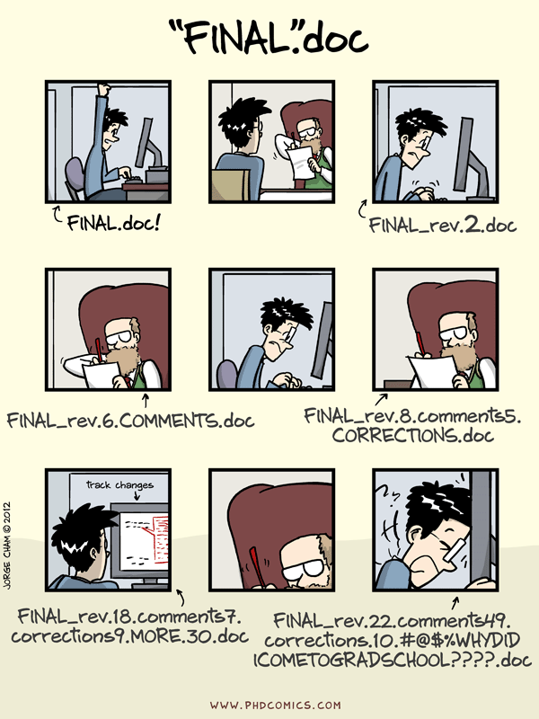

##

After this class you will be able to 

- use five main git operations: init, add, commit, push, pull 
- start a project with RStudio and keep it under version control with git
- submit your homework with git and github

##

Why are we doing this?

http://www.phdcomics.com/comics/archive.php?comicid=1531

## git

History is important to understand why it works like:

- created to enable development of Linux kernel
- very decentralized (and democratic)
- you can commit without being connected to the internet
- designed so that you have lots of control over your commits
- for our purposes: local copy and github copy

## git

- different model than dropbox
- not file model, but content model 
- matches RStudio project 
- can use git without github

## github

- remote for git
- faciliates collaboration
- add extra social features

## start a project and keep it under version control

Live demo

## start a project and keep it under version control

Questions?

## submit your homework via git

Live demo (http://www.princeton.edu/~mjs3/soc504_s2015/submitting_homework.shtml)

## submit your homework via git

Questions?

## 

Goal check

## 

motivation for next class
