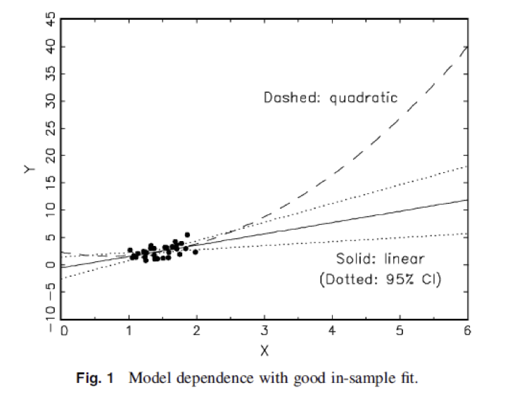
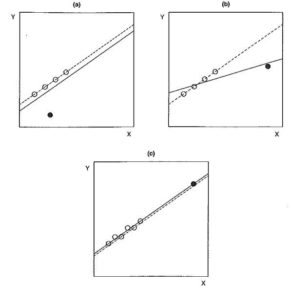
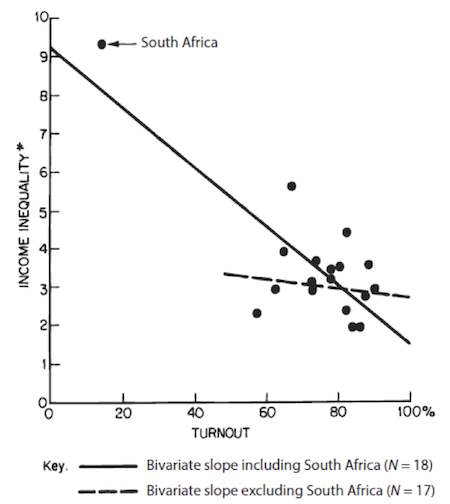
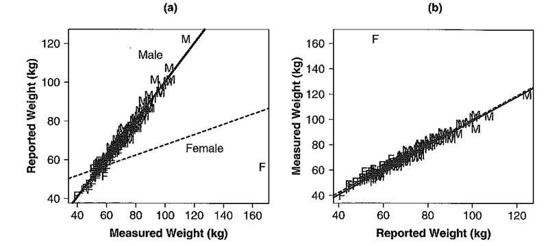

##

```{r echo=FALSE}
rm(list=ls())
```

# logistics

## { .build }
 
- Congrats Andres, Kyonne, Kalyani, Nick, Liora, Leah, and Aaron

- live debugging
- [how to ask a good question](http://stackoverflow.com/help/how-to-ask) on piazza based on stackoverflow
- projects (don't do something you don't understand)

##


## 

After this class you will be able to 

- explain what is a regression line and what is a residual is words, equations, and pictures
- explain the relationship between a regression coefficient and a correlation coefficent in words, equations, and pictures
- compare and contrast extrapolation and interpolation
- compare and contrast outliers, leverage, and influence

Note that in this class we are going to do this with single predictor models and next class we will do this with two predictor models.

##

To make things concrete, we will talk about the relationship between education and income.

##

What is a regression line and what is a residual is words, equations, and pictures?

##

Here is some data from the GSS.

```{r}
suppressPackageStartupMessages(library(dplyr))
load("data/gss_2010_training.RData")
gss.training <- tbl_df(gss.training)
gss <- select(gss.training, income06_n, educ, maeduc, paeduc) %>%
  filter(!is.na(income06_n), !is.na(educ), !is.na(maeduc), !is.na(paeduc))
# NOTE: DROPPING MISSING DATA LIKE THIS CAN BE DANGEROUS
gss <- rename(gss, income = income06_n)
```

## 

```{r}
suppressPackageStartupMessages(library(ggplot2))
p <- ggplot(gss, aes(x=educ, y=income))
p + geom_point() + xlab("Years of education") + ylab("Income category") 
```

## 

```{r echo=FALSE}
suppressPackageStartupMessages(library(ggplot2))
```

```{r}
p <- ggplot(gss, aes(x=educ, y=income))
p + geom_jitter() + xlab("Years of education") + ylab("Income category") 
```


##

```{r}
p <- ggplot(gss, aes(x=educ, y=income))
p + geom_jitter() + stat_smooth(method = "lm", se = FALSE) + 
  xlab("Years of education") + ylab("Income category") 
```

##

```{r}
p <- ggplot(gss, aes(x=educ, y=income))
p + geom_jitter() + stat_smooth(method = "lm", se = FALSE) + 
  xlab("Years of education") + ylab("Income category")  
```

Show residual with hands!

##

The regression line is the line that minimizes the sum of the squared residuals. The residual is the difference between the predicted income and actual income for each person in the sample.

$$\mbox{income}_i = \beta_0 + \beta_1 \times \mbox{educ}_i + \mbox{residual}_i$$ 

$$\widehat{\mbox{income}}_i = \beta_0 + \beta_1 \times \mbox{educ}_i $$ 


## { .smaller .build }

How is this line picked instead of all the other possible lines?

```{r}
p <- ggplot(gss, aes(x=educ, y=income))
p + geom_point() + stat_smooth(method = "lm", se = F) + xlab("Years of education") + ylab("Income category") +
  geom_abline(intercept = 6, slope = 1, color = "red") +
  geom_abline(intercept = 10, slope = 0.5, color = "green")
```

Minimize sum of squared residuals

## { .smaller .build }

How is this line picked instead of all the other possible types of relationships?

```{r}
p <- ggplot(gss, aes(x=educ, y=income))
p + geom_point() + xlab("Years of education") + ylab("Income category") +
  geom_smooth(data = filter(gss, educ < 12), method = "lm" , se = F, color = "blue") +
  geom_smooth(data = filter(gss, educ >= 12), method = "lm", se = F, color = "blue")
```

Investigator choice

##

What is the relationship between a regression coefficient and a correlation coefficent in words, equations, and pictures?

## 

What is the relationship between a regression coefficient and a correlation coefficent in words, equations, and pictures?

$$\hat{\beta_1} = corr(educ, income) \times \frac{SD(income)}{SD(educ)}$$

or 

$$\hat{\beta_1} = corr(educ, income) \times \frac{SD(educ)}{SD(income)}$$

How can you figure out which is correct?

## 

What is the relationship between a regression coefficient and a correlation coefficent in words, equations, and pictures?

Just in case you don't believe me

```{r}
library(broom)
fit <- lm(income ~ educ, data = gss)
tidy(fit)
```

```{r}
cor(gss$income, gss$educ) * (sd(gss$income) / sd(gss$educ))
```

## 

What is the relationship between a regression coefficient and a correlation coefficent in words, equations, and pictures?

The regression coefficient is a rescaled correlation.  

The fact that these two are so closely related so make you think that there is *nothing magical about regression*.

## 

What is the relationship between a regression coefficient and a correlation coefficent in words, equations, and pictures?

```{r}
gss <- mutate(gss, educ.days = educ * 365)
gss <- mutate(gss, educ.decades = educ / 10)
```


```{r}
# TODO: make plot
```

##

Is the correlation coefficient scale invariant?

Is the regression coefficient scale invariant?

##

compare and contrast extrapolation and interpolation

##

- Extrapolaiton makes predictions outside of the data
- Interpolation makes predictions inside of the data

Which seems worse?

## Extrapolation



<div class="cite">
From King and Zeng (2006) [The dangers of extreme counterfactuals](http://gking.harvard.edu/files/counterft.pdf)
</div>

## Interpolation { .smaller }

```{r} { .smaller }
gss.subset <- filter(gss, educ %in% c(8, 12, 16))
p <- ggplot(gss.subset, aes(x = educ, y =income))
p + geom_point() + xlab("Years of education") + ylab("Income category") +
  geom_smooth(method = "lm" , se = F)
```

## 

compare and contrast outliers, leverage, and influence. 

## { .build }

Influence = Leverage x Discrepancy



<div class="cite">
From [Fox (2008)](http://socserv.socsci.mcmaster.ca/jfox/Books/Applied-Regression-2E/index.html) Chapter 11 
</div>

##  { .build }

Use the words influence, leverage, and discrepancy to describe what is happening in this image.



South Africa has high leverage because it is far from the other data and it is discprent from the rest of the data.  Therefore, South Africa has a huge influence on the regression coefficient.

<div class="cite">
From [Healy and Moody (2014)](http://kieranhealy.org/files/papers/data-visualization.pdf) from [Jackman (1980)](http://www.jstor.org/stable/pdf/2095134.pdf?acceptTC=true) 
</div>

## 

Use the words influence, leverage, and discrepancy to describe what is happening in this image.



<div class="cite">
From [Fox (2008)](http://socserv.socsci.mcmaster.ca/jfox/Books/Applied-Regression-2E/index.html) Chapter 11 
</div>


# wrap-up

## 

Questions?

## 

Goal check

## 

motivation for next class

##

##

```{r}
sessionInfo()
```
