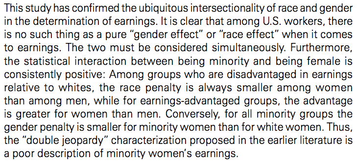

##

Logisitcs:


##


## 

After this class you will be able to 

- match theoretical models to interaction models
- explain why it is important to include constitutive terms in a model with interactions
- recognize when consitutive terms have not been included
- interpret models with interactions between dichotomous and continuous variables


##

To make things concrete, we will study the relationship between education and income.

```{r}
suppressPackageStartupMessages(library(dplyr))
load("data/gss_2010_training.RData")
gss.training <- tbl_df(gss.training)
gss <- select(gss.training, income06_n, educ, maeduc, paeduc, sex) %>%
  filter(!is.na(income06_n), !is.na(educ), !is.na(maeduc), !is.na(paeduc), !is.na(sex))
# NOTE: DROPPING MISSING DATA LIKE THIS CAN BE DANGEROUS
gss <- rename(gss, income = income06_n)
```

##

- Brambor et al. advise: include interaction terms whenever there is a conditional hypotheses

Hypothesis: The relationship between education and income is different for women and men.

or

Hypothesis: There is a relationship between education and income.

$$\widehat{income}_i = \beta_0 + \beta_1 educ_i + \beta_2 sex_i + \beta_3 sex_i * educ_i$$

##

$$\widehat{income}_i = \beta_0 + \beta_1 educ_i + \beta_2 sex_i + \beta_3 sex_i * educ_i$$

```{r}
library(broom)
```

```{r}
fit <- lm(income ~ educ + sex + educ:sex, data = gss)
tidy(fit)
```

##

"Every binary variable that you turn in for any work in this course must be renamed and recoded such that the values of the variable are 0/1, and the name of the variable carries mnemonic significance consistent with 1=yes and 0=no."

"Your instructor generally has a life philosophy that punishments should be roughly proportional to the magnitude of offenses. With respect to this particular matter, however, all bets are off. His belief is that how you handle binary variables has emblematic significance for how you approach data analysis, and, specifically, whether you approach data analysis in a way that minimizes mistakes and confusion for yourself and others. Consider it akin to a `broken windows' theory of orderly data analysis."

-- Jeremy Freese, (syllabus for Statistical Analysis of Social Data II, Spring 2013) [http://www.boydetective.net/wp-content/uploads/2014/07/401-2SyllabusSpring2013.pdf]

## 

```{r}
gss <- mutate(gss, female = as.numeric(sex=="female"))
```

```{r}
gss
```

##

```{r}
fit <- lm(income ~ educ + female + educ:female, data = gss)
tidy(fit)
```

##

- "include all constitutive terms when specifying multiplicative interaction models except in very rare circumstances"

##

Is this good or bad?

```{r}
fit <- lm(income ~ educ + educ:female, data = gss)
tidy(fit)
```

## { .build }

Draw a picture showing why this is bad.

```{r}
library(ggplot2)
```

```{r}
fit <- lm(income ~ educ + educ:female, data = gss)
fit.df <- tidy(fit)
fit.df
```

## { .smaller }

```{r}
inter <- as.numeric(filter(fit.df, term=="(Intercept)") %>%
                      select(estimate))
slope.male <- as.numeric(filter(fit.df, term=="educ") %>%
                      select(estimate))
slope.female <- slope.male + as.numeric(filter(fit.df, term=="educ:female") %>% 
                                          select(estimate))
```

```{r}
p <- ggplot(gss, aes(x=educ, y=income, col=sex))
p + geom_jitter() + 
  scale_color_manual(values = c("blue", "pink")) +
  geom_abline(intercept = inter, slope = slope.male, col="blue") + 
  geom_abline(intercept = inter, slope = slope.female, col="pink")
```

##

Why would we possibly want to require that men and women have the same predicted level of income at 0 years of schooling?

In other words, we should always think about what we are saying about the world when we run models.

##

```{r}
fit <- lm(income ~ educ + female + educ:female, data = gss)
fit.df <- tidy(fit)
fit.df

inter.male <- as.numeric(filter(fit.df, term=="(Intercept)") %>%
                         select(estimate))
inter.female <- inter.male + as.numeric(filter(fit.df, term=="female") %>%
                                        select(estimate))
slope.male <- as.numeric(filter(fit.df, term=="educ") %>%
                      select(estimate))
slope.female <- slope.male + as.numeric(filter(fit.df, term=="educ:female") %>% 
                                          select(estimate))
```

##

```{r}
p <- ggplot(gss, aes(x=educ, y=income, col=sex))
p + geom_jitter() + 
  scale_color_manual(values = c("blue", "pink")) +
  geom_abline(intercept = inter.male, slope = slope.male, col="blue") + 
  geom_abline(intercept = inter.female, slope = slope.female, col="pink")
```

Let's compare pictures with and without all constituitive terms

## { .build }

- "do not interpret consitutive terms as if they are unconditional marginal effects"

```{r}
fit <- lm(income ~ educ + female + educ:female, data = gss)
tidy(fit)
```

It would be strange to say people with one year of additional education are predicted to have 0.6 higher income (sorry that income is not measured in dollars).

The difference in predict values depends on whether the respondent is a man or a woman.  That's the whole point of the model!

##

- "calculate substantively meaning marginal effects and standard errors"

Always try to capture your unceratinty.  When you do these, please return to the paper of [Brambor et al (2006)](http://dx.doi.org/10.1093/pan/mpi014).

We could talk about this point, but I would rather spend our limited time on other issues.

##


[Greenman and Xie (2008)](http://www.jstor.org/stable/20430793)

## { .build }


Write this model in an equation.

## { .build .smaller }


$$\begin{eqnarray} 
log(inc_{i}) &=& \beta_0 + \nonumber \\
& & \beta_1 Chinese_i + \beta_2 Asian Indian + . . . + \beta_{18} Native American + \nonumber \\
& & \beta_{19} female_i + \nonumber \\
& & \beta_{20} Chinese_i * female_i + \beta_{21} Asian Indian * female_i +  . . .  + \nonumber \\
& & \epsilon_i
\end{eqnarray}$$

## { .build }

Why are there 18 race/ethnicity dummy variables and 19 race/ethnicity groups studied?

- omitted group (whites) is measured by intercept $\beta_0$

## { .build }

If a person was a white man what would the model look like?

$$\begin{eqnarray} 
log(inc_{i}) &=& \beta_0 + \nonumber \\
& & \epsilon_i
\end{eqnarray}$$

## { .build }

If the person was a white female what would like the model look like?

$$\begin{eqnarray} 
log(inc_{i}) &=& \beta_0 + \nonumber \\
& & \beta_{19} female_i + \nonumber \\
& & \epsilon_i
\end{eqnarray}$$

## { .build }

If a person was a Chinese-American man what would the model look like?

$$\begin{eqnarray} 
log(inc_{i}) &=& \beta_0 + \nonumber \\
& & \beta_1 Chinese_i + \nonumber \\
& & \epsilon_i
\end{eqnarray}$$

## { .build }

If the person was a Chiniese-American female what would like the model look like?

$$\begin{eqnarray} 
log(inc_{i}) &=& \beta_0 + \nonumber \\
& & \beta_1 Chinese_i + \nonumber \\
& & \beta_{19} female_i + \nonumber \\
& & \beta_{20} Chinese_i * female_i + \nonumber \\
& & \epsilon_i
\end{eqnarray}$$


## { .build }


Interpret column 6 in words.

## 


Interpret column 6 in words.

- "The effect of gender is always weaker among minorities than whites"
- predicted incomes for women in 18 non-white race/ethnicity groups are higher in a model that includes an interaction term than in a model that does not include an interaction term


## 
How would this pattern be visible in the residuals of this model?

$$\begin{eqnarray} 
log(inc_{i}) &=& \beta_0 + \nonumber \\
& & \beta_1 Chinese_i + \beta_2 Asian Indian + . . . + \beta_{18} Native American + \nonumber \\
& & \beta_{19} female_i + \nonumber \\
& & \epsilon_i
\end{eqnarray}$$

Hint: Here's the full model
$$\begin{eqnarray} 
log(inc_{i}) &=& \beta_0 + \nonumber \\
& & \beta_1 Chinese_i + \beta_2 Asian Indian + . . . + \beta_{18} Native American + \nonumber \\
& & \beta_{19} female_i + \nonumber \\
& & \beta_{20} Chinese_i * female_i + \beta_{21} Asian Indian * female_i +  . . .  + \nonumber \\
& & \epsilon_i
\end{eqnarray}$$

## { .build }


How much does this increase how much you believe this result?

## { .build }

How must their code be organized in order to be able to run these checks reliably?

Hint: Use this picture to help structure your thoughts and language.


Image by Roger Peng

## 



# wrap-up

## 

Questions?

## 

Goal check

## 

motivation for next class

##

##

```{r}
sessionInfo()
```
