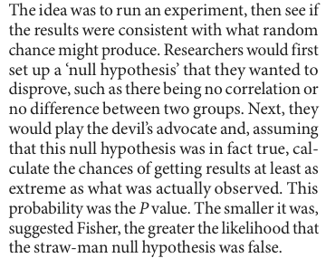
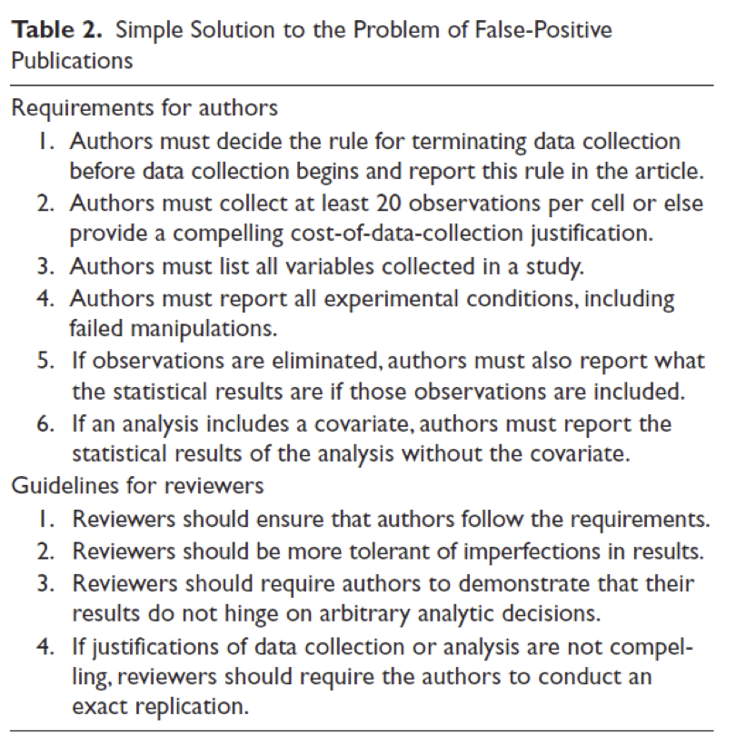
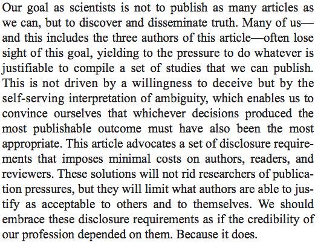
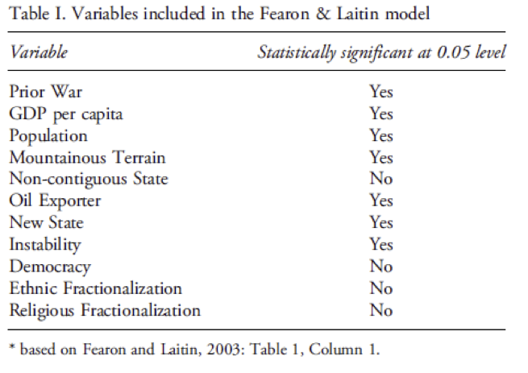
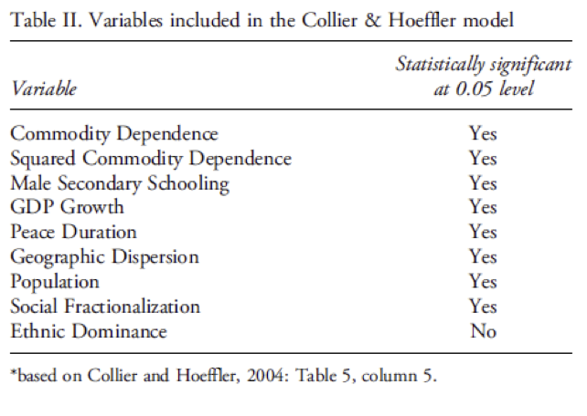
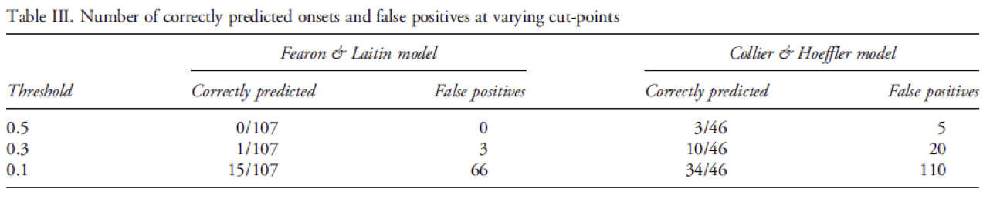

##

Logisitcs:

- please ignore travis-ci stuff for now
- we are going to leave a lot of time for discussion in class today

questions?

##


##

At the end of this class you will be able to

- explain why obsession with p-values is worse than useless
- describe simple alternatives that are more interesting


# what are p-values?

##



All p-values do is summarize the data with respect to a null/nil hypothesis

<div class="cite">
[Nuzzo (2014)](http://www.nature.com/news/scientific-method-statistical-errors-1.14700)
</div>

## 

As described in Cohen (!994) p-values are often misinterpreted.  But, this is not my main concern with p-values.

Even if correctly interpreted, p-values

- remove foucs from data, measurement, and theory (e.g., units)
- encourage dichotomous thinking
- lead to filtering of findings in journals based an arbitrary cut-off

# p-hacking

##

"p-hacking is trying multiple things until you get the desired result"

Uri Simonsohn in [Nuzzo (2014)](http://www.nature.com/news/scientific-method-statistical-errors-1.14700)

##


<div class="cite">
http://xkcd.com/882/
</div>

##

researcher degrees of freedom and distorted incentives are a bad combination

##



<div class="cite">
[Simmons et al (2011)](http://dx.doi.org/10.1177/0956797611417632)
</div>

##



<div class="cite">
[Simmons et al (2011)](http://dx.doi.org/10.1177/0956797611417632)
</div>

# What should you do?

## 

"don't look for a magical alternative to null hypothesis signficance testing, some other objective mechanical ritual to replace it.  It does not exist."

Cohen (1994)

But I think we can do better

# three simple rules to help move beyond p-values

## 1) Don't talk about p-values

compare:

- "the coefficient on education was significant at the 0.05 level" 

- "Other things being equal, an additional year of education would increase your annual income by $1,500 on average, plus or minus about $500."

- "People who more education earned more money.  Someone with one more year of education than someone else would be expected to earn about $1,500 more per year, plus or minus about $500."


## 2) talk about (and graph) confidence intervals

focuses attention on magnitude and interpretability, and still allows you to rule out 0 

## 3) talk about (and graph) more interesting summaries of complex models


<div class="cite">
http://animalstime.com/what-feed-baby-bird-what-feed-baby-birds/
</div>

##

Is there an inverse-U shaped relationship between age and voting?


<div class="cite">
http://animalstime.com/what-feed-baby-bird-what-feed-baby-birds/
</div>

and there are many more examples in the paper

# one not simple rule to move beyond p-values

##

Focus on prediction

##

the search for statistically significant relationships may be the best way to try to really explain what is happening in the world

## 



<div class="cite">
[Ward et al (2010)](http://dx.doi.org/10.1177/0022343309356491)
</div>

##



<div class="cite">
[Ward et al (2010)](http://dx.doi.org/10.1177/0022343309356491)
</div>

##



<div class="cite">
[Ward et al (2010)](http://dx.doi.org/10.1177/0022343309356491)
</div>

##

Focus on out of sample prediction is related to concerns about p-hacking

# wrap-up

##

goal check

## 

motivation for next class

##

```{r}
sessionInfo()
```
