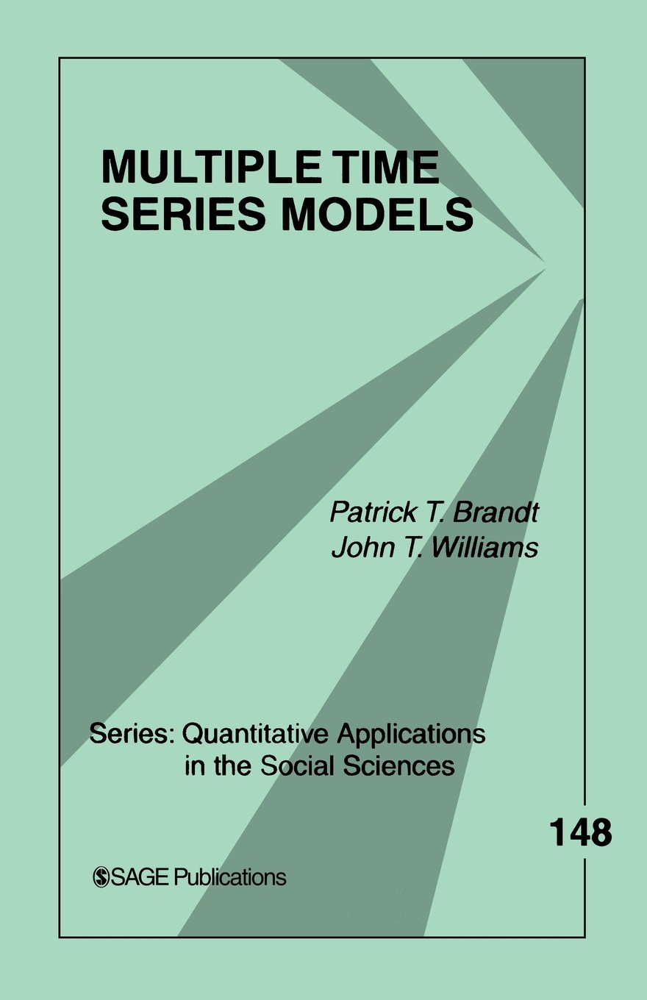

##

Logisitcs:

- reproduction due Sunday, March 15 at midnight
- no extensions, you will submit what you have (.Rmd and .html) in a github repo

##

Plan for this week:

- matrix approach to regression
- replication studio
- maximum likelihood approach to regression

This week is focused on the goal of enabling lifelong learning

# real motivating example

project of a classmate

##



##

http://srmo.sagepub.com/view/multiple-time-series-models/SAGE.xml

## 

After class today you will be able to 

- do matrix addtion
- do matrix multiplication
- understand linear regression written in matrix notation
- understand the solution to linear regression written in matrix notation

# matrix addition

##

$\begin{bmatrix} 4 & 3 & 7 \\ 3 & 8 & 2 \end{bmatrix}$ +
$\begin{bmatrix} 5 & 2 & 1\\ 2 & 1 & 5 \end{bmatrix}$ =
$\begin{bmatrix} 9 & 5 & 8\\ 5 & 9 & 7 \end{bmatrix}$ 

##

Now your turn

$\begin{bmatrix} 4 & 2 \\ 3 & 3 \\ 5 & 8 \end{bmatrix}$ +
$\begin{bmatrix} 3 & 1 \\ 7 & 2 \\ 3 & 5 \end{bmatrix}$ =

##

Now your turn

$\begin{bmatrix} 4 & 2 \\ 3 & 3 \\ 5 & 8 \end{bmatrix}$ +
$\begin{bmatrix} 3 & 1 \\ 7 & 2 \\ 3 & 5 \end{bmatrix}$ =
$\begin{bmatrix} 7 & 3 \\ 10 & 5 \\ 8 & 13 \end{bmatrix}$ 

##

Now your turn

$\begin{bmatrix} 4 & 2 & 5 \\ 3 & 3 & 7 \\ 5 & 8 & 4\end{bmatrix}$ +
$\begin{bmatrix} 3 & 1 \\ 7 & 2 \\ 3 & 5 \end{bmatrix}$ = 

##

Now your turn

$\begin{bmatrix} 4 & 2 & 5 \\ 3 & 3 & 7 \\ 5 & 8 & 4\end{bmatrix}$ +
$\begin{bmatrix} 3 & 1 \\ 7 & 2 \\ 3 & 5 \end{bmatrix}$ = $\mathbf{NA}$

Matrix addition only works if the matricies are the same dimension (this foreshadows a related property for matrix multiplication)

# matrix multiplication

##

Example from [Wikipedia](http://en.wikipedia.org/wiki/Matrix_multiplication)

$\begin{bmatrix}
1 & 0 & 2 \\ 
-1 & 3 & 1\\
\end{bmatrix}$
$\begin{bmatrix} 
3 & 1 \\ 
2 & 1 \\ 
1 & 0 \\
\end{bmatrix}$
=
$\begin{bmatrix}1 \times 3 + 0 \times 2 + 2 \times 1 & 1 \times 1 + 0 \times 2 + 2 \times 1\\
-1 \times 3 + 3 \times 2 + 1 \times 1 & -1 \times 1 + 3 \times 1 + 1 \times 0 \end{bmatrix}$
=
$\begin{bmatrix} 5 & 1\\
4 & 2 \end{bmatrix}$

Note that $2 \times 3 \cdot 3 \times 2 = 2 \times 2$

##

More generally
$(\mathbf{AB})_{i,j} = \sum_{r=1}^n A_{i,r}B_{r,j}$ 

$\mathbf{A} = \begin{bmatrix}
1 & 0 & 2 \\ 
-1 & 3 & 1\\
\end{bmatrix}$

$\mathbf{B} =\begin{bmatrix} 
3 & 1 \\ 
2 & 1 \\ 
1 & 0 \\
\end{bmatrix}$

$\mathbf{AB} = 
\begin{bmatrix} 5 & 1\\
4 & 2 \end{bmatrix}$

##

If $A$ is $(r_1 \times c_1)$ and $B$ is $(r_2 \times c_2)$ then they can be multiplied if and only if $r_2 = c_1$.  If they can be multiplied the result is $r_1 \times c_2$

##

$\begin{bmatrix} 
3 & 1 \\ 
2 & 1 \\ 
1 & 0 \\
\end{bmatrix}$
$\begin{bmatrix}
1 & 0 & 2 \\ 
-1 & 3 & 1\\
\end{bmatrix}$

- What size is the first matrix?
- What size is the second matrix?
- Can they multiplied together?  If so, what will be the size of the result.
- Calculate the result.

##

$\begin{bmatrix} 
3 & 1 \\ 
2 & 1 \\ 
1 & 0 \\
\end{bmatrix}$
$\begin{bmatrix}
1 & 0 & 2 \\ 
-1 & 3 & 1\\
\end{bmatrix}$
=
$\begin{bmatrix}
3 \times 1 + 1 \times -1 & 3 \times 0 + 1 \times 3 & 3 \times 2 + 1 \times 1 \\
2 \times 1 + 1 \times -1 & 2 \times 0 + 1 \times 3 & 2 \times 2 + 1 \times 1 \\
1 \times 1 + 0 \times -1 & 1 \times 0 + 0 \times 3 & 1 \times 2 + 0 \times 1 \\
\end{bmatrix}$
=
$\begin{bmatrix}
2 & 3 & 7 \\
1 & 3 & 5 \\
1 & 0 & 2 \\
\end{bmatrix}$


- What size is the first matrix?: 3 x 2
- What size is the second matrix?: 2 x 3
- Can they multiplied together?  If so, what will be the size of the result.: yes

# matrix approach to regression

## 

$Y_i = \beta_0 + \beta_1 X_{i1} + \beta_2 X_{i2} + \beta_3 X_{i3} + \epsilon_i$

For 5 people this would be

$y_1 = \beta_0 + \beta_1 x_{11} + \beta_2 x_{12} + \beta_3 x_{13} + \epsilon_1$

$y_2 = \beta_0 + \beta_1 x_{21} + \beta_2 x_{22} + \beta_3 x_{23} + \epsilon_2$

$y_3 = \beta_0 + \beta_1 x_{31} + \beta_2 x_{32} + \beta_3 x_{33} + \epsilon_3$

$y_4 = \beta_0 + \beta_1 x_{41} + \beta_2 x_{42} + \beta_3 x_{43} + \epsilon_4$

$y_5 = \beta_0 + \beta_1 x_{51} + \beta_2 x_{52} + \beta_3 x_{53} + \epsilon_5$

##

$\begin{bmatrix} y_1 \\ y_2 \\ y_3 \\ y_4 \\ y_5 \end{bmatrix}$ = 
$\begin{bmatrix} 
 1 & x_{11} & x_{12} & x_{13} \\
 1 & x_{21} & x_{22} & x_{23} \\
 1 & x_{31} & x_{32} & x_{33} \\
 1 & x_{41} & x_{42} & x_{43} \\
 1 & x_{51} & x_{52} & x_{53} \\
\end{bmatrix}$
$\begin{bmatrix} \beta_0 \\ \beta_1 \\ \beta_2 \\ \beta_3 \end{bmatrix}$ +
$\begin{bmatrix} \epsilon_1 \\ \epsilon_2 \\ \epsilon_3 \\ \epsilon_4 \\ \epsilon_5 \end{bmatrix}$

$y_1 = \beta_0 + \beta_1 x_{11} + \beta_2 x_{12} + \beta_3 x_{13} + \epsilon_1$

$y_2 = \beta_0 + \beta_1 x_{21} + \beta_2 x_{22} + \beta_3 x_{23} + \epsilon_2$

$y_3 = \beta_0 + \beta_1 x_{31} + \beta_2 x_{32} + \beta_3 x_{33} + \epsilon_3$

$y_4 = \beta_0 + \beta_1 x_{41} + \beta_2 x_{42} + \beta_3 x_{43} + \epsilon_4$

$y_5 = \beta_0 + \beta_1 x_{51} + \beta_2 x_{52} + \beta_3 x_{53} + \epsilon_5$

## { .smaller }

$\mathbf{y} = \begin{bmatrix} Y_1 \\ Y_2 \\ Y_3 \\ Y_4 \\ Y_5 \end{bmatrix}$

$\mathbf{X} = \begin{bmatrix} 
 1 & x_{11} & x_{12} & x_{13} \\
 1 & x_{21} & x_{22} & x_{23} \\
 1 & x_{31} & x_{32} & x_{33} \\
 1 & x_{41} & x_{42} & x_{43} \\
 1 & x_{51} & x_{52} & x_{53} \\
\end{bmatrix}$

$\mathbf{\beta} = \begin{bmatrix} \beta_0 \\ \beta_1 \\ \beta_2 \\ \beta_3 \end{bmatrix}$

$\mathbf{\epsilon} = \begin{bmatrix} \epsilon_1 \\ \epsilon_2 \\ \epsilon_3 \\ \epsilon_4 \\ \epsilon_5 \end{bmatrix}$

##

$\mathbf{Y} = \mathbf{X} \mathbf{\beta} + \mathbf{\epsilon}$

# solution to linear regression written in matrix notation

##

$\mathbf{y} = \mathbf{X} \mathbf{\beta} + \mathbf{\epsilon}$

Want to find $\mathbf{b}$ that minimizes the residual sum of squares.

It turns out (see Fox and many other books for a derivation) that 

$\mathbf{b} = \mathbf{(X'X)^{-1}X'y}$

To understand this we need to learn two new matrix operations

- $X'$ (transpose)
- $(X'X)^{-1}$ (inverse)

# wrap-up

## 

questions?

##

goal check

## 

motivation for next class

##

```{r}
sessionInfo()
```
