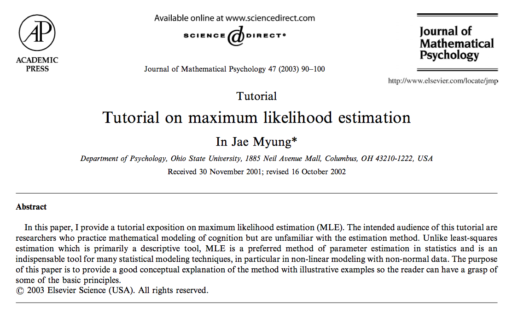

##

Logisitcs:

- projects are due Sunday at midnight

questions?

##

today's class will be disappointing, I apologize in advance

##

At the end of this class you will be able to

- walk through a simple example of maximum liklihood for the binomial model 
- understand new R techniques: vectorized code, testing
- do a better job writing reusable code


##



<div class="cite">
http://dx.doi.org/10.1016/S0022-2496(02)00028-7
</div>

##

Two general approaches to parameter estimation:

- least-squares estimation
- maximum likelihood estimation

# probability

##

pr[data | parameters, model]

What is the probability of observing y successes in 10 Bernoulli trials where w = 0.2?

##

The famous coin flipping distribution:

$pr(y \mid n, w) = {n \choose w} w^y (1-w)^{n-y}$

where

${n \choose w} = \frac{n!}{y! (n-y)!}$

##

$f(y | n = 10, w = 0.2) = \frac{10!}{y!(10-y)!} (0.2)^y (0.8)^{(10-y)}$

##

```{r}
# for illustrative purposes only
# if you were doing on this on a real problem you would need to do something more computationally efficient

y.vec <- 0:10
factorial(10)/factorial(10 - y.vec)
```

##

```{r}
p.vec <- factorial(10)/(factorial(y.vec) * factorial(10 - y.vec)) * 0.2 ^ y.vec * 0.8 ^ (10 - y.vec)

# automated testing, and what is with that weird test?
if (abs(sum(p.vec) - 1) > 0.000001) stop("ERROR calculating p.vec")
p.vec
```

##

```{r}
library(ggplot2)
df <- data.frame(heads = y.vec, prob = p.vec)
p <- ggplot(df, aes(x = heads, y = prob))
p + geom_bar(stat="identity") + scale_x_discrete(limits = df$heads)
```

## { .smaller }

```{r}
w <- 0.5
n <- 10
heads.vec <- 0:n
p.vec <- factorial(n)/(factorial(heads.vec) * factorial(10 - heads.vec)) * w ^ heads.vec * w ^ (10 - heads.vec)
if (abs(sum(p.vec) - 1) > 0.000001) stop("ERROR calculating p.vec")
df <- data.frame(heads = y.vec, prob = p.vec)
p <- ggplot(df, aes(x = heads, y = prob))
p + geom_bar(stat="identity") + scale_x_continuous(breaks = df$heads)
```

##

Pick your favorite w

Pick your favorite n

##

Programming concepts:

- vectorization
- error testing
- resuable code

##

pr[data | parameters, model]

What is the probability of observing y successes in 10 Bernoulli trials where w = 0.2?

$f(y | n = 10, w = 0.2) = \frac{10!}{y!(10-y)!} (0.2)^y (0.8)^{(10-y)}$

# inference

##

find parameters most likely given data and model

Imagine that we have 7 heads in 10 tosses.  What value of $w$ was most likely to generate that data?

$L(w | n = 10, y = 7) = \frac{10!}{7!3!} w^7 (1 - w)^3$

##

One can find the maximum using calculus or computationally.  Here we do it graphically.

## { .smaller }

```{r}
w.vec <- seq(from = 0, to = 1, by = 0.01)
l.vec <- (factorial(10)/(factorial(7) * factorial(3))) * w.vec^7 * (1 - w.vec)^3
df <- data.frame(w.vec = w.vec, l.vec = l.vec)
p <- ggplot(df, aes(x = w.vec, y = l.vec))
p + geom_line()
```

##

Now you generalize the code for $n$ tosses and $y$ successes

## { .smaller }

```{r}
w.vec <- seq(from = 0, to = 1, by = 0.01)
n <- 10
y <- 7
l.vec <- (factorial(n)/(factorial(y) * factorial(n - y))) * w.vec^y * (1 - w.vec)^(n-y)
df <- data.frame(w.vec = w.vec, l.vec = l.vec)
p <- ggplot(df, aes(x = w.vec, y = l.vec))
p + geom_line()
```

##

In practice we usually work with log-liklihoods.

# maximum likelihood approach to regression

##

$y_i = \beta_0 + \beta_1 x_i + \epsilon_i$

$p(y_i) = \frac{1}{\sigma_\epsilon \sqrt{2 \pi}} exp \left[- \frac{(y_i - \beta_0 + \beta_1 X_i)^2}{2 \sigma_\epsilon^2} \right]$

$L(\beta_0, \beta_1, \sigma_{\epsilon^2} \mid y, x) = \prod_{i=1}^n \frac{1}{\sigma_\epsilon \sqrt{2 \pi}} exp \left[- \frac{(y_i - \beta_0 + \beta_1 x_i)^2}{2 \sigma_\epsilon^2} \right]$

# wrap-up

##

goal check

## 

motivation for next class

##

```{r}
sessionInfo()
```
