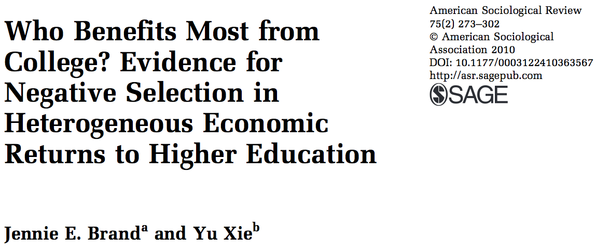
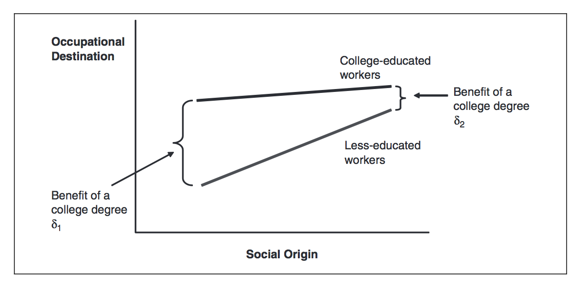

##

Logisitcs:

- plan for project reviews

questions?

##

Pilot testing titles:

- Tour of the Terminal: Using Unix or Mac OS X Command-Line
- Getting your computation running in the cloud
- Getting your computation running on Princeton's cloud
- Linux Solutions for Big Data 


##

plan for next two weeks (added as a course goal):

Explain the limitations of observational data for making causal claims, and begin to use existing strategies for attempting to make causal claims from observational data


##

At the end of this class you will be able to

- use the language of potential outcomes to discuss specific social science problems
- feel that causal inference without experiments requires strong assumptions and should be done with extreme caution and humility

##


<div class="cite">
http://www.nytimes.com/2007/09/16/magazine/16epidemiology-t.html
</div>

##

What is the effect of hormone replacement therapy (HRT)?

## { .build }

Nurses' Health Study, an observational study, say that it helps women.

By 2001, 15 million women were filling perscriptions for HRT.

HERS clinical trial finds that HRT hurts women.

WHI clinical trial also finds that HRT hurts women.

What's going on?

## healthy-user bias

women taking HRT were less likely to die of homicide, suicide, and accidents.


## prescriber effects

maybe doctors only prescribed HRT to health patients. A more general example of thinking about how treatment gets assigned (either selecting into treatment or how society allocates treatments)

##

Offers three explainations:

1) observational studies is wrong because of healthy-user bias and prescriber effect

2) observational studies are wrong because meaturement issues (less interesitng for now)

3) observational studies and clinical trials are both right, but they just apply to different populations

##

Even with lots of money and time, causal inference is hard.  

##

"The whole point of science is self-doubt," he [Avorn] says, "and asking could there be another explanation for what we’re seeing."

# potential outcomes and individual-level treatment effects

##

What is the effect of college on earnings for person i?

$$\delta_i = y_{i}^1-y_{i}^0$$

- $y_{i}^1$, earnings for person $i$ with college
- $y_{i}^0$, earnings for person $i$ without college
- $\delta_i$, effect of college on earnings for pereson $i$

##

<!---
starter code taken from here: http://stackoverflow.com/questions/19997242/simple-manual-rmarkdown-tables-that-look-good-in-html-pdf-and-docx
-->

```{r table2, echo=FALSE, message=FALSE, warnings=FALSE, results='asis'}
table <- "
| Person | Income with college ($y_{i}^1$)  | Income without college ($y_{i}^0$) | Effect  |
|:------:|:-------------:|:--------:|:--------:|
| Peter  | $50,000       | $40,000  | $10,000  |
| Paul   | $74,000       | $90,000  | -$16,000 |
| Mary   | $70,000       | $70,000  | 0        |
"
cat(table) 
```

For some people there effect of college is positive, for some negative, and for some zero.

##

Consider the worker training context (e.g., a program to teach people to type).  

- What is a group of people for whom the training might have a positive effect? 
- What is a group of people for whom the training might have no effect?

##

Consider this political ad: 
https://www.youtube.com/watch?v=bZxs09eV-Vc

If positive is more support for Obama, for whom might the effect be positive and for whom might the effect be negative?

What does that many about estimating the average effect of the ad?

# fundemental problem of causal inference

##

```{r, echo=FALSE, message=FALSE, warnings=FALSE, results='asis'}
table <- "
| Person | Income with college ($y_{i}^1$)  | Income without college ($y_{i}^0$) | Effect  |
|:------:|:-------------:|:--------:|:--------:|
| Peter  | $50,000       | $40,000  | $10,000  |
| Paul   | $74,000       | $90,000  | -$16,000 |
| Mary   | $70,000       | $70,000  | 0        |
"
cat(table) 
```

##

```{r, echo=FALSE, message=FALSE, warnings=FALSE, results='asis'}
table <- "
| Person | Income with college ($y_{i}^1$)  | Income without college ($y_{i}^0$) | Effect  |
|:------:|:-------------:|:--------:|:--------:|
| Peter  | $50,000       | ?        | ?  |
| Paul   | ?       | $90,000  | ? |
| Mary   | $70,000       | ?  | ?        |
"
cat(table) 
```

$$\hat{\delta}_{naive} = E[y_i \mid d_i = 1] - E[y_i \mid d_i = 0]$$

$$\hat{\delta}_{naive} = 60,000 - 90,000 = -30,000$$

naive estimator can be badly wrong

##

Three common quantities of interest

- average treatment effect (ATE)

$E[\delta] = E[Y^1] - E[Y^0]$

- average treatment effect for the treated (ATT)

$E[\delta \mid D = 1] = E[Y^1 \mid D=1] - [Y^0 \mid D=1]$

- average treatment effect for control (ATC)

$E[\delta \mid D = 0] = E[Y^1 \mid D=0] - [Y^0 \mid D=0]$

Which is more interesting in job training program?

Which is more interesting in research about Catholic schools?

##

When does the naive estimator work?

Assumption 1: $E[Y^1 \mid D=1] = E[Y^1 \mid D=0]$ 

Assumption 2: $E[Y^0 \mid D=1] = E[Y^0 \mid D=0]$ 

If (1) and (2), then

$ATE = ATT = ATC = \hat{\delta}_{naive}$

##

We will not discuss

- 2.8 Over-time potential outcomes and causal effects
- 2.9 The potential outcome model for many-valued treatments

But, notice how the main ideas from the simple case can be generalized. 

# new case

##



##

Who has the most to gain from going to college?

```{r, echo=FALSE, message=FALSE, warnings=FALSE, results='asis'}
table <- "
| Person | Income with college ($y_{i}^1$)  | Income without college ($y_{i}^0$) | Effect  |
|:------:|:-------------:|:--------:|:--------:|
| John  | $100,000       | $80,000  | $20,000  |
| Paul   | $120,000       | $110,000  | $10,000 |
| Ringo   | $70,000       | $20,000  | $50,000  |
| George   | $60,000       | $30,000  | $30,000 |
"
cat(table) 
```

##



##

Express their prediction in the language of potential outcomes and heterogenity of treatment effects.

## 

Let $Y_i$ be occupational destination

$E[\delta \mid class = low] > E[\delta \mid class = high]$

$E[Y^1 | orgin = low] >> E[Y^0 | class = low]$

$E[Y^1 | orgin = high] > E[Y^0 | class = high]$

$E[Y^1 | orgin = high] > E[Y^1 | orgin = low]$

$E[Y^0 | orgin = high] >> E[Y^0 | orgin = low]$


# SUTVA

##

Stable-unit treatment value assumption

$y_{i}^1 = y_i^1(\vec{d})$

$y_{i}^0 = y_i^0(\vec{d})$

where $\vec{d}$ is a vector of treatments.

When is this close to true?  When is the totally wrong?

##

Can policy experiments every really inform policy?

# causes of effects and effects of causes

##

1) causes of effects
2) effects of causes

Which can we do?

Which do we want to do?


# wrap-up

##

goal check

## 

motivation for next class

##

http://bit.do/soc504feedback

##

```{r}
sessionInfo()
```
