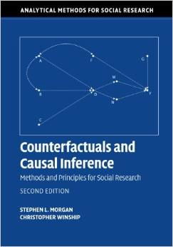
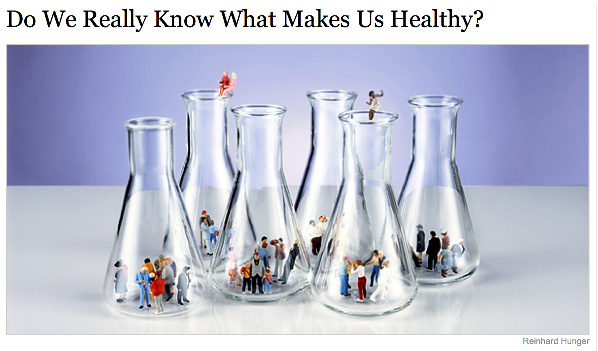

##

Logisitcs:

- plan for project reviews

questions?

##

plan for next two weeks (added as a course goal):

Explain the limitations of observational data for making causal claims, and begin to use existing strategies for attempting to make causal claims from observational data




##

At the end of this class you will be able to


##

# warm-up

##



<div class="cite">
http://www.nytimes.com/2007/09/16/magazine/16epidemiology-t.html
</div>

##


# wrap-up

##

goal check

## 

motivation for next class

##

```{r}
sessionInfo()
```
