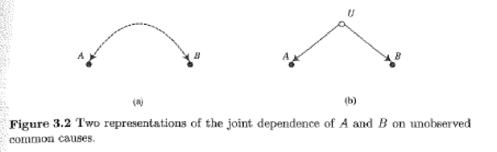
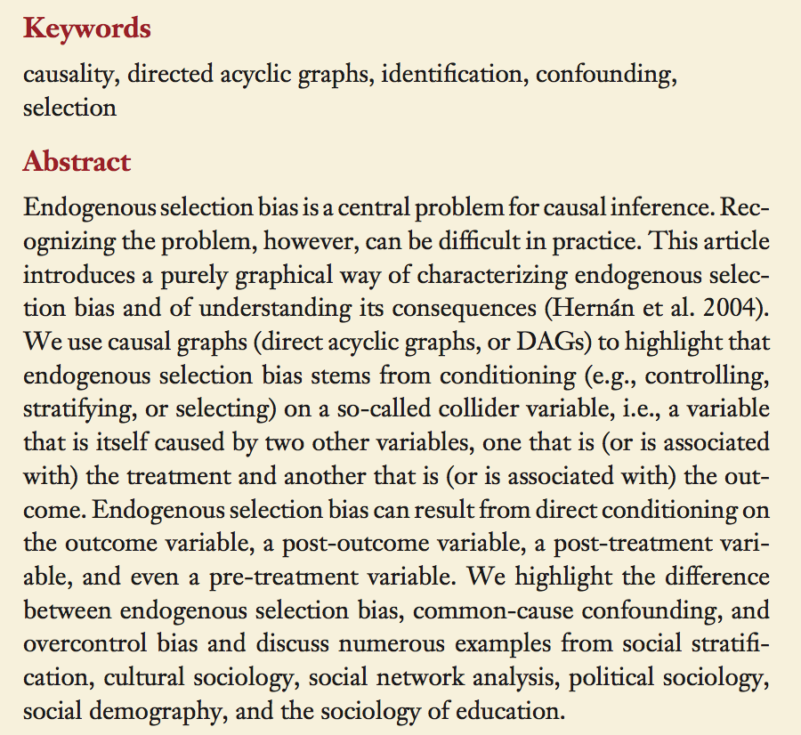
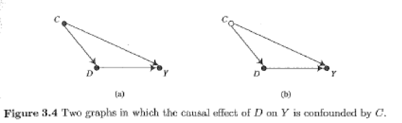
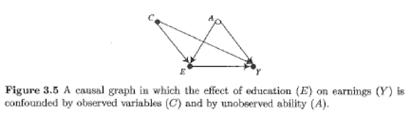

##

Logisitcs:

- stories from Harvard about open and reproducible research
- feedback from last class, please fill it out for this class
- `Maybe too depressing? . . . for those of us interested in policy change, we need some hope that social science can actually make meaningful recommendations, . . . .'
- "More has been leanred about causal inference in the last few decades than the sum total of everything that has been learned about it all prior recorded history . . . " - Gary King
- I have no progress to report yet on the feedback for your projects; I'm sorry about that

questions?

##

Big picture goal:

Explain the limitations of observational data for making causal claims, and begin to use existing strategies for attempting to make causal claims from observational data

##

At the end of this class you will be able to

- explain and use the concept of identification
- read and understand causal graphs
- write causal graphs for your problem (if it is about causal inference)
- be prepared to learn about the back-door criteria

# review

## 

Two main frameworks for causal inference
 
- potential outcomes
- causal graphs

Are they the same?  I'm not sure

##

As far as I can tell, 

- potential outcomes better for thinking about heterogenity of treatment effects
- causal graphs between for thinking about conditioning

causal inference is too rich to have just one framework

you could eat with just a fork, but why not use a fork, spoon, and knife when needed

# identification

##

What is possible to know with infite data of one type?

These kind of impossibility results can be very helpful in ruling things out.

In my mind, identification issues are way more important and intersting than statistical significance.

## { .build }

An example of a problem that is not identified involving daycare, the sound of babies cry, closed doors, and a decible counter.

A more serious example: Do charter schools education more effectivly for students who are enrolled in them?  (ATT)

## 

Your examples of identification problems . . . .


# causal graphs

##

Basic building blocks with 2 variables

A -> B



##

Basic building blocks with more than 2 variables


What are social science examples of these?

##

Mediation:

Family background -> years of formal schooling -> income

Note that this assumes that family background has no direct effect on income.

In other words, the arrows that you leave out are as important as the arrows that 
you draw.  One way to think of causal graph creation is deciding which nodes and edges not to include.

##

Mutual dependence:

years of education <- mental ability -> income

Again, note which arrows and which nodes are not here 

##

Mutual caustion (collider variables)

years of education -> income <- mental ability

Again, note which arrows and nodes are not here

- collider variables seem to be very tricky ("don't condition on colliders on a back-door path"; I'm quite not sure why yet)

##


http://dx.doi.org/10.1146/annurev-soc-071913-043455

##



http://dx.doi.org/10.1146/annurev-soc-071913-043455

##

Which enables conditioning?



##

Good enough?




# Graphs and structural equations

##

causal graphs vs path models

- causal graphs make no distributional assumptions about errors
- causal graphs make no assumptions about linear additivity
- causal graphs don't easily allow you to move from a picture to a set of estimates 

# example

##

Which of your research proposals involved causal questions?  Can we draw causal graphs for them?

# preview of back-door paths

## 

http://csm.lshtm.ac.uk/files/2011/10/Bianca-Rhian-06-10-2011.pdf


# wrap-up

##

goal check

## 

motivation for next class

##

Please give your feedback so that this class can get better

http://bit.do/soc504feedback

##


```{r}
sessionInfo()
```
