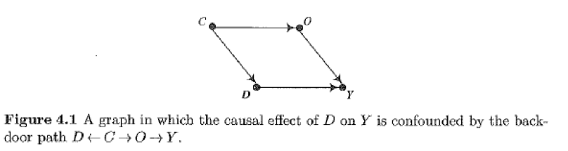
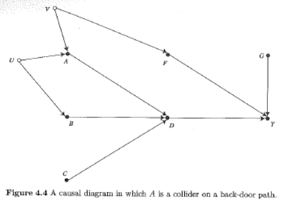
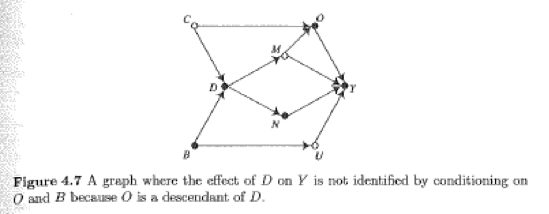
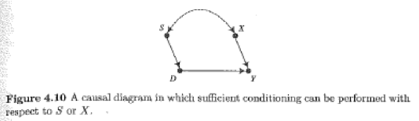
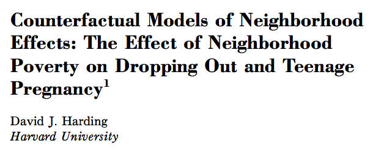
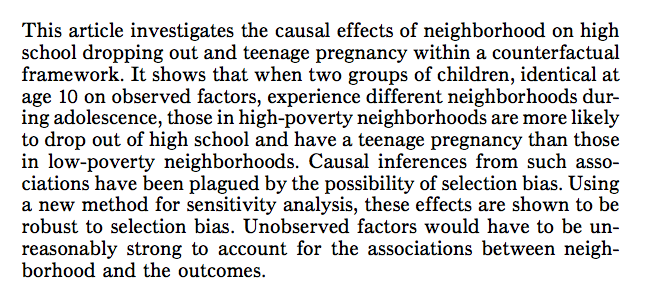
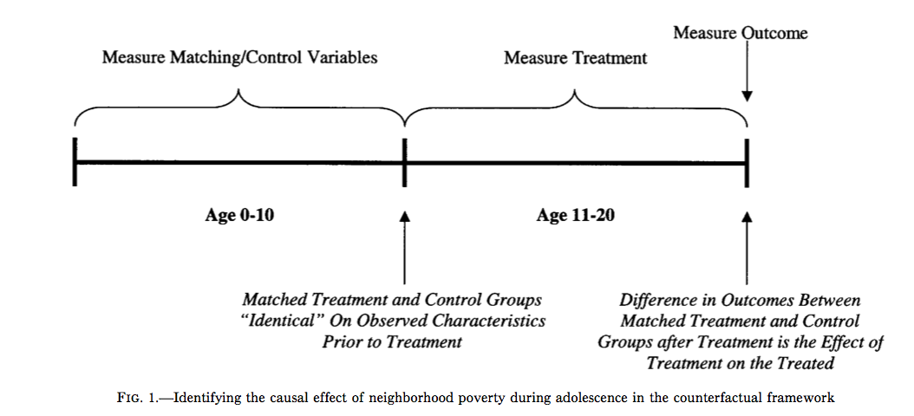
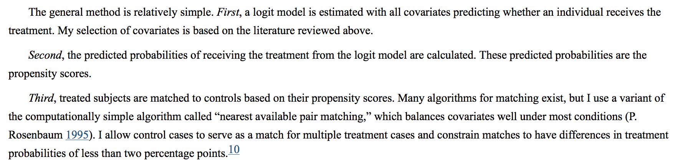
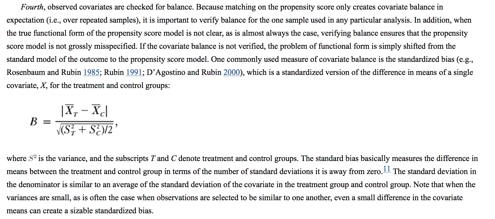
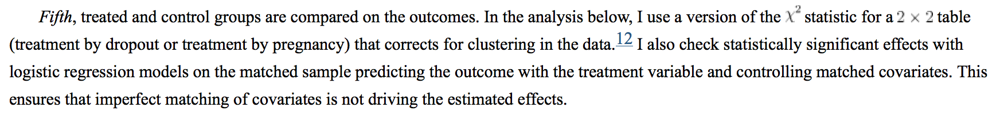

##

Logisitcs:

- feedback on projects
- if your replication is finished, you need to send me and Angela you schedule for getting it completed
- if your replciation is finished, please start on the extension
- we will not be doing peer feedback right now
- Florencia Torche, today at 4:30pm in Aaron Burr, Room 216

questions?

##

Big picture goal:

Explain the limitations of observational data for making causal claims, and begin to use existing strategies for attempting to make causal claims from observational data

##

At the end of this class you will be able to


##

Three main approaches to causal inference:

1) conditioning on variables to block on back-door paths
2) using exogenous variation in instrumental variable
3) establishing exhasutive and isolated mechanisms

##



Bback-door path: roughly something thatpoints for treatment and outcome 

D <- C -> O -> Y

## { .build }

What conditioning strategies would work on this graph?



- condition on F
- condition on A and B

## { .build }

Should you condition on O?



- no (even though it looks like adjusting for all other causes of the outcome) because violates condition 2 (we don't want to condition on descendents of treatment)

## 

Morgan and Winship's two favorite things

- shows that researchers do not need to condition all everything
- clarifies conditioning on endogenous variables

##

Back-door criteria also consistent with eariler ideas

- statistics (modeling assignment mechanism)
- econometrics (modeling treatment selection mechanism)

##

Causal graphs are not inconsistent with heterogenity of treatment effects

Often we can get them by weighting the estimates from subgroups

##

- Matching: balance determinants of the causal variable (S)
- Regression: technique to adjust for other causes of outcome (X)



# matching

##

- matching exactly
- matching on propensity score
- more complicated matching . . .

## 



<div class="cite">
http://www.jstor.org/stable/10.1086/379217
</div>

##



<div class="cite">
http://www.jstor.org/stable/10.1086/379217
</div>

##



<div class="cite">
http://www.jstor.org/stable/10.1086/379217
</div>

##



<div class="cite">
http://www.jstor.org/stable/10.1086/379217
</div>

##



<div class="cite">
http://www.jstor.org/stable/10.1086/379217
</div>

##



<div class="cite">
http://www.jstor.org/stable/10.1086/379217
</div>

##

Matching conclusions

- forces thinking about ATT, ATC, ATE
- forces consideration of region of common support
- not magic
- looks good for big data

# wrap-up

##

goal check

## 

motivation for next class

##

http://bit.do/soc504feedback

##


```{r}
sessionInfo()
```
