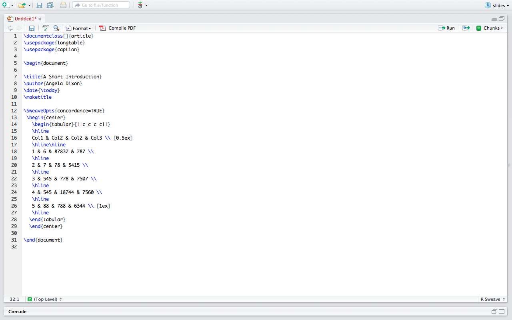
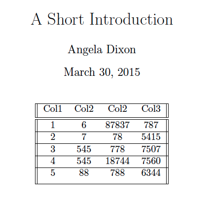

## {.smaller}


<br><br> <br> <br> <br><br> <br> <br> <br><br> <br> <br> 
<br> <br><br> <br> <br>    

** Inspiration for the LaTeX slides in this lab comes from the work of Austin L. Wright, Department of Politics, Princeton University  

##  Goals for Today

1. Introduce LaTeX 
2. Practice making nice tables in R
3. Return to second regression coefficients graph from last week's lab

## Introduction to LaTeX: Why use LaTeX
- Customizability of tables  
- Elegant typesetting 
- Easily incorporate math symbols into documents 
- Informal signal   

## Why people don't use LaTeX
- VERY, VERY steep learning code  
- Challenges with collaboration (see https://www.sharelatex.com/ for one solution)  
- Can not see output in real time (see Latexian)  
- Compilation  


## LaTeX distributions options

- Mac: MacTeX (https://tug.org/mactex/)  
- PC: MikTeX  

<br>
- You need to install a distribution before LaTeX will compile on your computer

## LaTeX: Starting a document 

- Preamble  
- Title section  
- Beginning the document  
- Adding content  
- Ending the document  

## LaTeX: Starting a document {.smaller}

- Preamble: class of document, loading packages, setting font size     
```{r, eval=FALSE}
\documentclass[]{article}
\usepackage{longtable}
\usepackage{caption}
```
- Title section: standard information (title, author, date)  (optional)
```{r, eval=FALSE}
\title{A Short Introduction}
\author{Angela Dixon}
\institute{Princeton University - Department of Sociology}
\date{\today}
```
- Beginning the document: starts compilation process, line spacing
```{r, eval=FALSE}
\begin{document}
```
- Adding content: text, notation, figures, tables, citations  
- Ending the document: compilation, generating the document
```{r, eval=FALSE}
\end{document}
```

## LaTeX: Example 1 

In Latexian, the default will open with
```{r, eval=FALSE}
\documentclass[]{article}  

\begin{document}

\title{Title}
\author{Author}
\date{Today}
\maketitle

Content

\end{document}
```

## LaTeX: Example 1 


## Latex: Example 2 {.smaller}

Sweave Document


## Latex: Example 2



## LaTeX: More document types 

- Beamer (slides)    
- Books (your dissertation?) 
- Posters (conferences)  
- CV  

<br>
- Start by trying to find templates and modifying them  

- Documents from OPR's 2014 LaTeX workshop: https://www.dropbox.com/sh/y2esbxnzsws4sos/176KhEieUO

## LaTeX and R 

- Sweave  
- Rmarkdown
- stargazer  
- xtable  

## Automating Tables in R {.smaller}

*  Word on the (Wallace) street is that the stargazer package is currently the front-runner and the one I recommend 
* For help see:  
    + http://cran.r-project.org/web/packages/stargazer/stargazer.pdf
    + http://www.princeton.edu/~otorres/NiceOutputR.pdf
* Some helpful options within stargazer 
    + type ("latex", "text", "html") 
    + title
    + covariate.labels
    + dep.var.caption
    + dep.var.labels
    + column.labels
    + out
    + star.cutoffs
    + digits
    

## Time to Practice with “UN Data on Life Expectancy.”  {.smaller}

- Load the dataset from Fox:  
- http://socserv.socsci.mcmaster.ca/jfox/Books/Applied-Regression-2E/dataset/UnitedNations.txt  
- More info on dataset: http://socserv.socsci.mcmaster.ca/jfox/Books/Applied-Regression-2E/datasets/UnitedNations.pdf
- Create a regression table for the output of the regression of tfr on female education, contraception, and region
- Add a second model to the table with female life expectancy, gdp per capita, and female illiteracy as additional predictors


```{r, eval=FALSE}
#install.packages("stargazer")
library(stargazer)
library(dplyr)
library(broom)
df <-read.table("http://socserv.socsci.mcmaster.ca/jfox/Books/Applied-Regression-2E/datasets/UnitedNations.txt")
df$country <- rownames(df)
rownames(df) <- NULL
df <- tbl_df(df)
df
```


## Challenge: Turning Tables into Graphs Part 2 {.smaller}

* Turn the table from figure 8 into a graph with ggplot2 and add color 
* Kastellec and Leoni (2007) code: http://tables2graphs.com/doku.php?id=04_regression_coefficients
    + You can use the code from the link above to retrieve the numbers and variable names you will use.  
    + How can you make the Kastellec and Leoni (2007) code robust to changes in model specification (hint: broom package)?   
* Either replicate the graphs Kastellec and Leoni (2007) made or come up with your own improved graphs to better represent the data. 
* The graphs do not need to look identical. Work on ways can you approve on them, but still retain the same basic information. 
    

##  Goal Check 

1. Introduce LaTeX 
2. Practice making nice tables in R
3. Return to second regression coefficients graph from last week's lab


## Feedback

http://bit.do/soc504_lab

## Session Info
```{r}
sessionInfo()
```