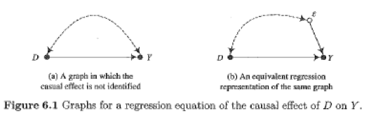
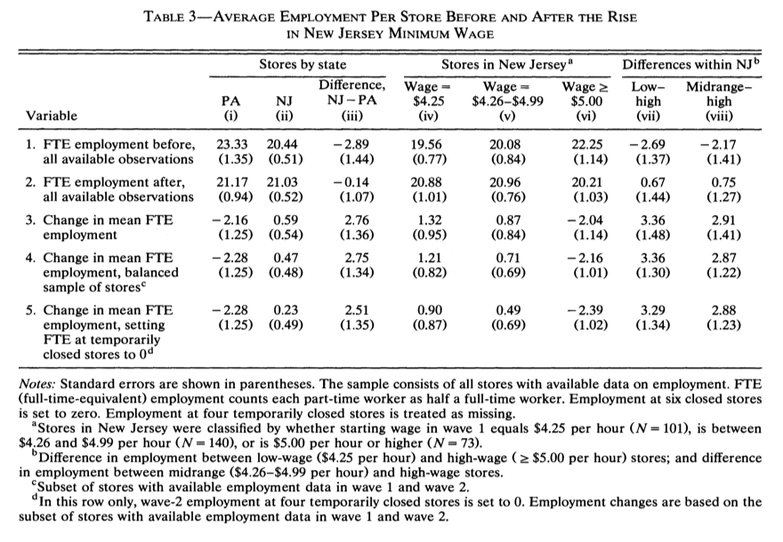

##

Logisitcs:

- Florencia Torche's talk

questions?

##

Big picture goal:

Explain the limitations of observational data for making causal claims, and begin to use existing strategies for attempting to make causal claims from observational data

##


At the end of this class you will be able to

- be skeptical about regression for causal inference (not satisfying)
- appreciate the value of getting the right data to make your claims

# regression as a descriptive modeling tool

##

According to M & W, regression is fine for

- prediction problem
- summarizing lots of data

Not good for saying what will be the outcome is some X is changed from k to k'

Also, raises doubts about what the "correct" specification of a model may be

# regression as a parameteric adjustment technique for causal effects

##



## 


## 

It is possible to express the idea of "breaking correlation between treatment and error term" in language of potential outcomes

##

Section 6.3 shows that regression does weird things when there is treatment effect heterogenity

##

Main strengths of regression for causal inference

- computational simplicity
- myriad forms
- familarity
- software availability

Notice what is not on this list!

## 

Weaknesses:

- suppresses attention to things like heterogenity which are common in matching
- confusing what assumptions are required

##

Questions about causal inference

# shoe leather

## 

Smoking and cancer; can't do fancy talk with RA Fischer

##

1: Mortality and health data

- Maybe the increase in smoking is caused by a change in diagnostic patterns?  Nope.  They have records from autopsies (necroscopies) and lots of them (see Figure 1)
- Maybe more people are getting old and lung cancer is a disease of the old so cancer rates go up.  Doesn't affect age specific rates.
- Diagnostic factors, but what explains the increase in male to female diagnosis ratio.   Also good evidence from Denmark TB station which has used standard procedures over many years.
- Urban-rural differences, not a problem
- sex differences, not a problem
- other factors exist (asbestos, coal plants, etc.), no a problem
- people who work at tobacco factory have lower death rates than other people in their state, but that's because they are working

Just to summarize, critic offers counter explanation and then new data is deployed to show that the counter explanation is not correct. The critic could then deploy a more complicated counter-explanation, but eventually this gets absurd.

##

Type 2: Retrospective and prospective studies (21 independent groups of investigators in 8 countries) and prospective method (3 independent groups in 2 countries)

- every study found an association between smoking and lung cancer
- every study that consider the form of smoking found a stronger association for cigarette smokers than pipe or cigar smokers
- every study that looked for a dose response relationship found it
- when ex-cigarette smokers were included, there cancer rates were lower that current smokers

##

Type 3: Studies of Pathogenesis (eg, why not increase in upper respiratory cancer)

- animal studies

##

Type 4: Lab studies

- can we extrapolate from mice to humans (maybe not, but the evidence is consistent)
- what is the right dose of smoke for a mouse (hard to say)

##

Three ideas:

- smoking causes lung cancer (either directly or by making people more susceptible to some other carcinogen)
- lung cancer causes smoking (actually proposed by Fisher!!!)
- smoking and lung cancer have a common cause (genetic?)

Problems with 3

- increased rate of lung cancer
- animal studies
- pipe smokers get cancer of the mouth not the lung
- people who stop smoking have a lower risk of lung cancer

# Minimum wage

##

"What attracted us to control groups is that we wanted to design our research scientifically, Professor Card said. "What would a skeptic consider convincing evidence?"

"Although they analyze many large government surveys, they think they get better insights by collecting their own data -- as they did by telephoning or writing to 400 fast food joints. "There was a time when we thought econometric techniques would solve a lot of the data problems," Professor Krueger said. "Now I think the feeling is that there are a lot of problems for which it is easier to get better data."

##


##




# wrap-up

##

goal check

## 

motivation for next class

##

http://bit.do/soc504_feedback

##


```{r}
sessionInfo()
```
