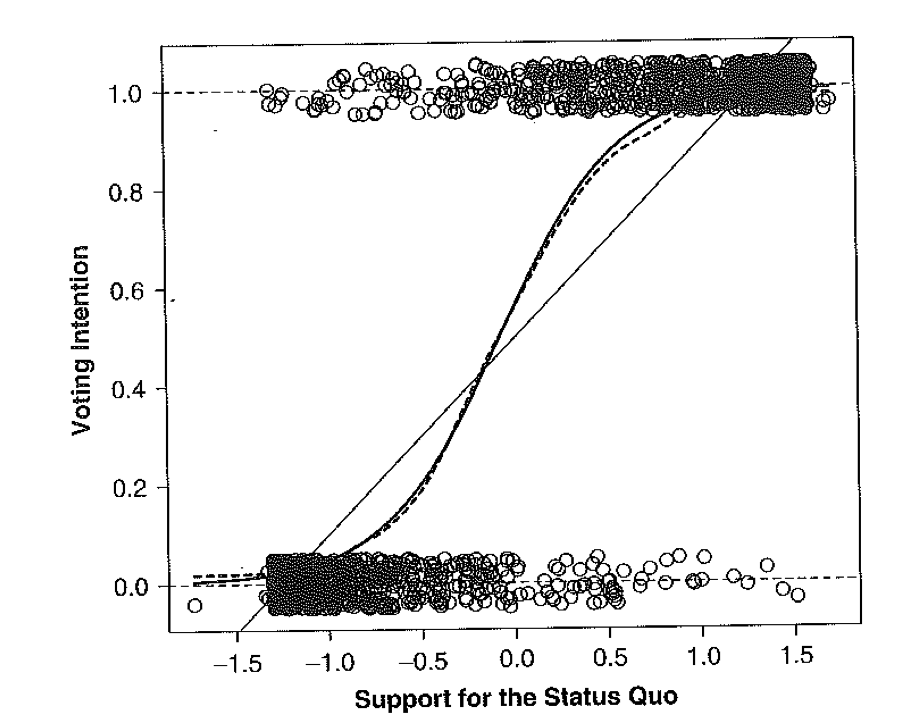
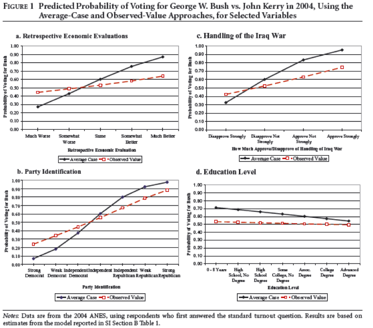
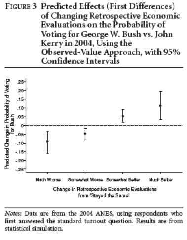
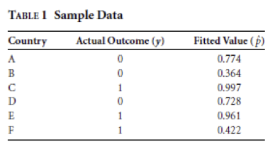
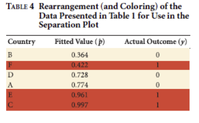
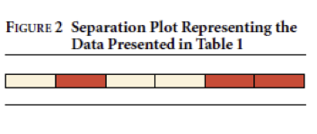
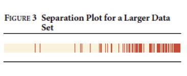
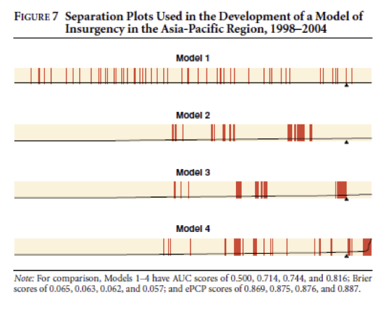
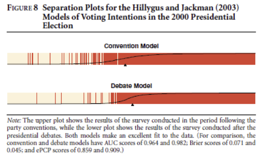
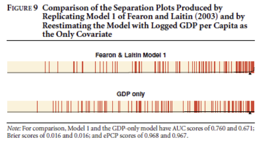

##

Logisitcs:

- no more posting Fox on blackboard
- no more deep philosophical issues for a while
- if you are finished with your replication, push ahead with your extension

questions?

##

At the end of this class you will be able to

- understand when you are supposed to use logistic regression
- interpret logistic regression results in terms of probability, odds, and log-odds
- create graphs that summarize the fit of a dichotomous outcome model


# dichotomous outcomes

##

Examples: drop-out of school or not, vote or not, other examples . . . 

Requires new models that change how we 

- interpret coefficents 
- evaluate model fit


##

predicted to vote yes by support for status quo



##

Using linear model when outcome is dichotmous is not ideal

- errors are not normally distributed
- errors cannot have constant variance
- makes predictions that are fundementally impossible

##

$$Y_i = \beta_0 + \beta_1 X_i$$

becomes

$$\pi_i = f(\beta_0 + \beta_1 X_i)$$

with logit becomes

$$\pi_i = \frac{1}{1 + e^{-(\beta_0 + \beta_1 X_i)}}$$

##

Three views of logistic regression

probability:
$$\pi_i = \frac{1}{1 + e^{-(\beta_0 + \beta_1 X_i)}}$$

odds:
$$\frac{\pi_i}{1 - \pi_i} = e^{(\beta_0 + \beta_1 X_i)}$$

log-odds:
$$ln(\frac{\pi_i}{1 - \pi_i}) = \beta_0 + \beta_1 X_i$$

##

<center>

</center>

$$ln(\frac{\pi_i}{1 - \pi_i}) = 0.215 + 3.21 * statusquo$$

What is the predicted log odds of someone voting yes if their support for status quo is 1?

What is the predicted log odds of someone voting yes if their support for status quo is 0?

What is the predicted log odds of someone voting yes if their support for status quo is -1?

## { .smaller }

<center>

</center>

What is the predicted log odds of someone voting yes if their support for status quo is 1?

<span style="color:red">
$$ln(\frac{\pi_i}{1 - \pi_i}) = 0.215 + 3.21 * 1 = 3.425$$
</span>

What is the predicted log odds of someone voting yes if their support for status quo is 0?

<span style="color:red">
$$ln(\frac{\pi_i}{1 - \pi_i}) = 0.215 + 3.21 * 0 = 0.215$$
</span>

What is the predicted log odds of someone voting yes if their support for status quo is -1?

<span style="color:red">
$$ln(\frac{\pi_i}{1 - \pi_i}) = 0.215 + 3.21 * -1 = -2.995$$
</span>

##

Treating this like linear regression is going to cause problems with interpretation

##

<center>

</center>

$$ln(\frac{\pi_i}{1 - \pi_i}) = 0.215 + 3.21 * status_quo $$

What is the predicted odds of someone voting yes if their support for status quo is 1?

What is the predicted odds of someone voting yes if their support for status quo is 0?

What is the predicted odds of someone voting yes if their support for status quo is -1?

## { .smaller }

<center>

</center>

What is the predicted odds of someone voting yes if their support for status quo is 1?

<span style="color:red">
$$\frac{\pi_i}{1 - \pi_i} = e^{0.215 + 3.21 * 1} = 30.7$$
</span>

What is the predicted odds of someone voting yes if their support for status quo is 0?

<span style="color:red">
$$\frac{\pi_i}{1 - \pi_i} = e^{0.215 + 3.21 * 0} = 1.2$$
</span>

What is the predicted odds of someone voting yes if their support for status quo is -1?

<span style="color:red">
$$\frac{\pi_i}{1 - \pi_i} = e^{0.215 + 3.21 * -1} = 0.05$$
</span>

##

Unless you have lots of experience with horse racing, thinking in terms of odds is difficult

##

<center>

</center>

$$ln(\frac{\pi_i}{1 - \pi_i}) = 0.215 + 3.21 * status_quo $$

What is the predicted probability of someone voting yes if their support for status quo is 1?

What is the predicted probability of someone voting yes if their support for status quo is 0?

What is the predicted probability of someone voting yes if their support for status quo is -1?

## { .smaller }

<center>

</center>

What is the predicted probability of someone voting yes if their support for status quo is 1?

<span style="color:red">
$$\pi_i = \frac{1}{1 + e^{-(0.215 + 3.21 * 1)}} = 0.97$$
</span>

What is the predicted probability of someone voting yes if their support for status quo is 0?

<span style="color:red">
$$\pi_i = \frac{1}{1 + e^{-(0.215 + 3.21 * 0)}} = 0.55$$
</span>

What is the predicted probability of someone voting yes if their support for status quo is -1?

<span style="color:red">
$$\pi_i = \frac{1}{1 + e^{-(0.215 + 3.21 * -1)}} = 0.05$$
</span>

##

Review of three views of logistic regression

probability:
$$\pi_i = \frac{1}{1 + e^{-(\beta_0 + \beta_1 X_i)}}$$

odds:
$$\frac{\pi_i}{1 - \pi_i} = e^{(\beta_0 + \beta_1 X_i)}$$

log-odds:
$$ln(\frac{\pi_i}{1 - \pi_i}) = \beta_0 + \beta_1 X_i$$

##

Interpretation point 2: How much you move depends on where you are.

<center>

</center>

A difference in 0.1 in support leads to a difference of 3.21 in log-odds of voting yes.

A difference in 0.1 in support leads to a multiplicitive difference of e^3.21 in odds of voting yes.

A difference in 0.1 in support leads to an unknown difference in the probability of voting yes.

When we move to a model with multiple predictors it as if everything is interacted with everything else.

# more on interpreting logistic regression

##

Interpreting model output

Hanmer and Kalkan distinguish between:

- average case (most common)
- observed value (probably better)

##

Consider the case of voting for GWB in 2004.  

Average case is:
a white, 48-year-old women; identifies as independent; associates degree; political moderate; believes economic performance has been the same; disapporves of the Iraq war but not strongly; has income between $45,000 and $50,000

##

probability:
$$\pi_i = \frac{1}{1 + e^{-(\beta_0 + \beta_1 age + \beta_2 white + \ldots)}}$$


##

<center>

</center>

## { .build }

Try to come up with an argument for why the average-case method will tend to produce bigger changes than the observed-case method.

Average cases are likely to be in the "middle" of the data where the predicted probabilities are changing the fastest.  Think about Bill O'rielly and Rachel Maddow.  They are going to show up in the observed-case method but the average-case method.

##

<center>

</center>

# more on model fit in logistic regression

##

How well does model fit the data?

Greenhill, Ward, and Sacks (2011)

##

<center>

</center>

##

<center>

</center>

##

<center>

</center>

##

<center>

</center>

##

<center>

</center>

##

<center>

</center>

##

<center>

</center>

# wrap-up

##

goal check

## 

motivation for next class

##

http://bit.do/soc504_feedback

##


```{r}
sessionInfo()
```
