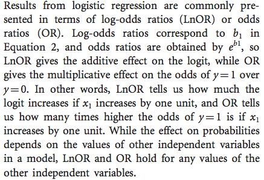
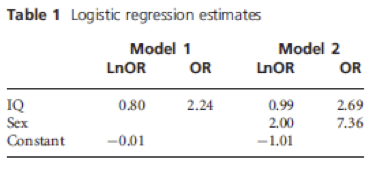
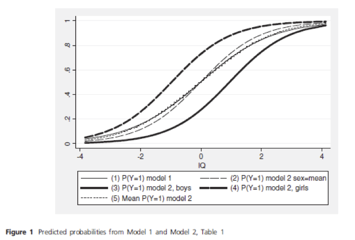
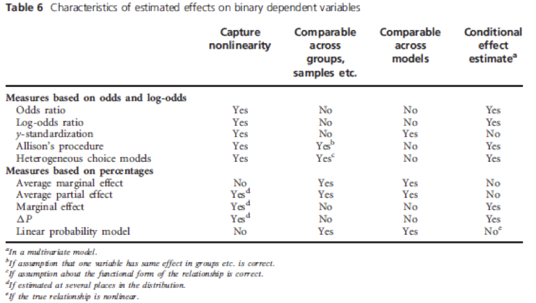
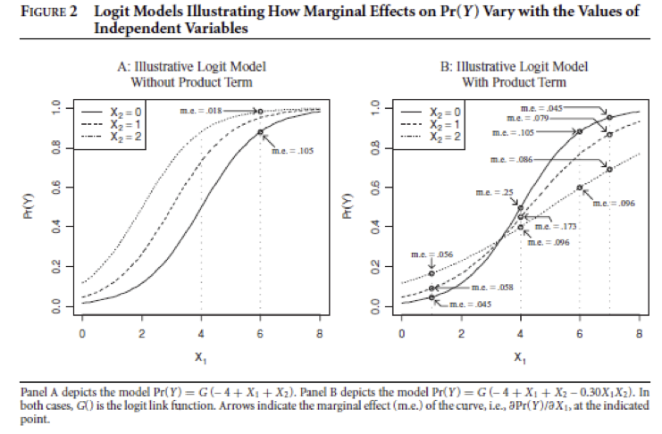
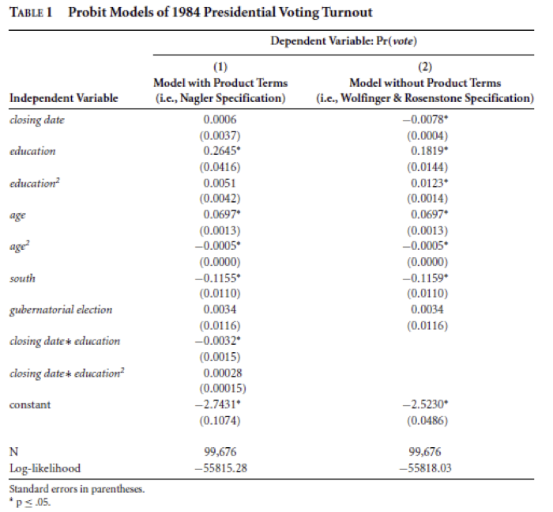
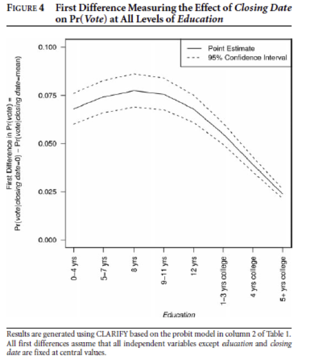

##

Logisitcs:

- suggestions about the visit days
- OPR workshops
- I am behind on giving you feedback on your projects, keep going . . .
- we will have a homework assingment next week :)

questions?

##

At the end of this class you will be able to

- begin to have an opinion about comparing logistic regression across groups 
- begin to have an opinion about interactions in logistic regression
- feel a bit more comfortable with the mechanics of logistic regression

Key theme: Logistic regression is different than linear regression.  You might need to have an opinion about this stuff so we can struggle through it a bit together.

# latent variable interpretation of logistic regression

##

y* that is unobserved that is linearly related to $\beta_0 + \beta_1 x$

if y* > 0 then y = 1

if y* < 0 then y = 0

##

$$y_i^* = \alpha + x_{1i} \beta_1 + \epsilon_i$$

If $\epsilon_i$ follows a logistic distribution with a fixed variance of 3.29 then

$$ln( \frac{p}{1-p} ) = a + x_{1i}b_1$$

##




# logistic regression: why we cannot do what we think we can do

##

"We cannot compare log-odds ratios or odds ratios for similar models across groups, samples, or timepoints."

##



Draw a picture and explain what is going on here.  This could take a while.

## 



##

Solution

- don't do logistic regression
- do it a bunch of different ways

##

Solution



# product term interactions

##

key idea is "compression" because outcome is bounded between 0 and 1

##



##

Wolfinger and Rosenstone "liberalizing registration provisions would have by far the greatest impact on the least education adn relatively little impact on the most well education"

- Does this sound like an interaction?
- Is an interaction required to make this claim?

##

What to do?

If you think there is an interaction in the model for Y* then include the product term.

##



##



## 

How do you go from the table to the figure?

# wrap-up

##

goal check

## 

motivation for next class

##

http://bit.do/soc504_feedback

##


```{r}
sessionInfo()
```
