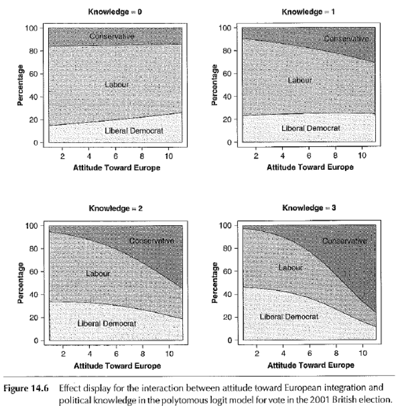
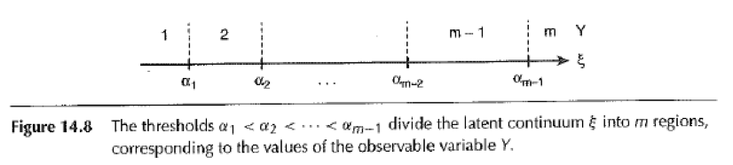
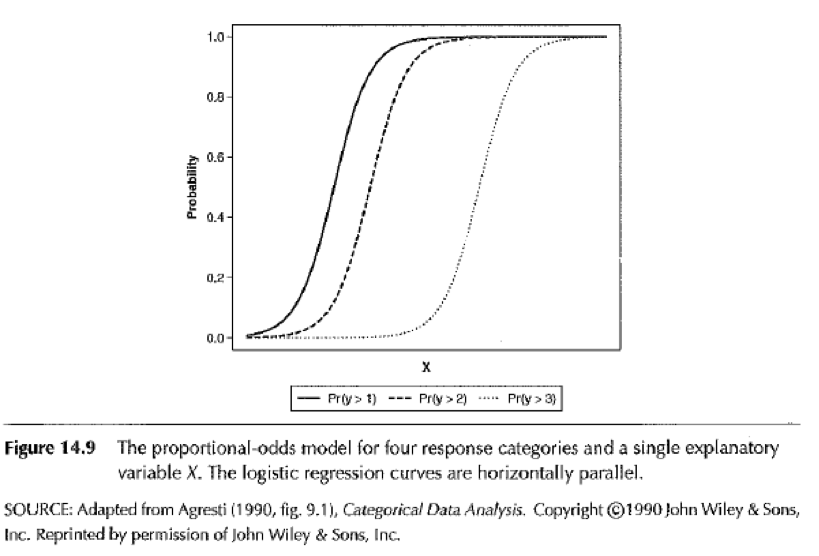
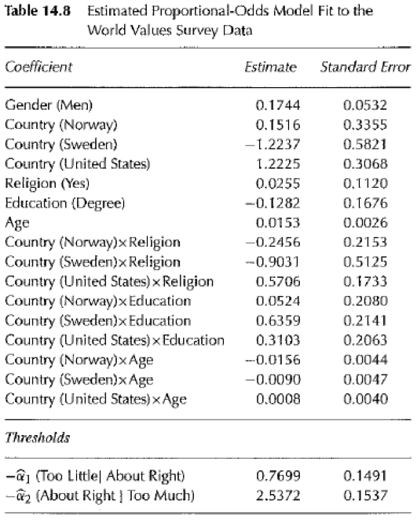
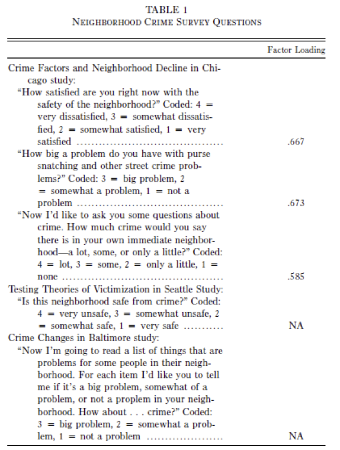

##

Logisitcs:

- homework on logistic regression due via github Sunday, April 19 at midnight
- replication and extension projects due via github Sunday, April 26 at midnight
- lab on Monday, April 27 present your projects (exact schedule TBA)
- receive all feedback from Matt, Angela, and peers by Sunday, May 3 at midnight
- replication and extension project due Tuesday, May 12 at midnight

questions?

##

At the end of this class you will be able to

- identify what is a polytomous outcome
- describe the main modeling strategies used for polytomous outcomes 
- begin to interpret output from these models

Key themes: Lots of ideas from logistic regression generalize

# polytomous outcomes

##

Dichotomous outcomes: vote for Obama or not, drop out of high school or not,  . . .

Polytomous outcomes: high school, college, or grad school; vote Conservative, Labour, or Liberal Democrat

##

Three approaches

1) modeling the polygamy directly as a set of *unordered* categories using a generalization of the dichotomous logit model

2) constructing a set of nested dichotomies from the polygamy, fitting an independent logit or probit model to each polytomy

3) extending the unobserved-variable interpretation of the dichotomous logit and probit models to *ordered* polytomies

We will focus on  (1) and (3)


##

What is an example of an ordered polyotmous outcome and an unordered polytomous outcome?

# polytomous logit for unordered categories

## 

$Y$: Vote in the 2001 British election

Outcomes are (1) Labor party, (2) Conservative Party, (3) Liberal Democratic party.  These are unordered.

$$
\pi_{ij} = Pr(Y_i = j)
$$

In words, what is the probability that person $i$ votes for party $j$?

## { .smaller }

We can use a multivariate logistic distribution:
$$\pi_{ij} = \frac{exp(\gamma_{0j} + \gamma_{1j}X_{i1} + \gamma_{2j}X_{i2} + \ldots + \gamma_{kj}X_{ik})}{1 + \sum_{l=1}^{m-1} exp(\gamma_{01} + \gamma_{1l}X_{i1} + \gamma_{2l}X_{i2} + \ldots + \gamma_{kl}X_{ik})} \mbox{ for } j = 1 \ldots m-1$$

$$
\pi_{ij} = 1 - \sum_{l=1}^{m-1} \pi_{ij} \mbox{ (for category } m) 
$$

## { .build }

Some algebraic manipulation leads to

$$log_e \frac{\pi_{ij}}{\pi_{im}} = \gamma_{0j} + \gamma_{1j}X_{i1} + \gamma_{2j}X_{i2} + \ldots + \gamma_{kj}X_{ik}$$
$$\mbox{ for } j = 1, \ldots, m-1$$

What happens with two outcomes?

$$log_e \frac{\pi_{i1}}{1 - \pi_{i1}} = \gamma_{01} + \gamma_{11}X_{i1} + \gamma_{21}X_{i2} + \ldots + \gamma_{k1}X_{ik}$$

##

Category $m$ is a kind of baseline against which all categories are measured.  

Does having a negative attitude toward Europe make you more likely to be a Labour supporter relative to Liberal Democrat?  

Does having a negative attitude toward Europe make you more likely to be a Labour supporter relative to Conservative?   

Also by combining the coefficients in a magic way, it is possible to make any possible comparison between categories (see Fox for derivation).

## { .build }

Attitude toward European integration is reverse-coded: 11 is most against


This is a trick question because of the interaction term

##



As political knowledge increases, better match between individual preferences and party positions.

# unobserved variable approach for ordered outcomes

## 

Imagine a latent unobserved variable $\zeta$ that is a linear function of $X$ plus a *random error* that follows a specific distribution. 

$$\zeta_i = \alpha + \beta_1 X_{i1} + \beta_2 X_{i2} + \ldots + \beta_k X_{ik} + \epsilon_i$$

$$Y_i = 
\begin{cases}
1 &\mbox{if } \zeta_i  \le \alpha_1 \\
2 &\mbox{if } \alpha_1 < \zeta_i  \le \alpha_2 \\
\vdots & \\
m-1 &\mbox{if } \alpha_{m-2} < \zeta_i  \le \alpha_{m-1} \\
m &\mbox{if } \alpha_{m-1} < \zeta_i  \\
\end{cases}
$$



Note that we estimate both the $\alpha$s and $\beta$s from the data

##



proportional odds model

##

``Do you think that what the government is doing for people in poverty is about the right amount, too much, or too little?''  Data from Australia, Sweden, Norway and USA.

Ordered outcome: too little, the right amount, too much

##



##


##

Fox concludes that polytomous logit has the greatest range of applications

# Quillian and Pager: Black Neighbors, Higher Crime? The Role of Racial Stereotypes in Evaluations of Neighborhood Crime

##

Interested in the causes of racial residential segregation.  Three questions:

- How is the presence of blacks in neighborhoods associated with perceptions of neighborhood crime?
- To what extent can the relationship between neighborhood racial composition and perceived crime be explained by other correlations neighborhood conditions?
- Does the association between racial composition of the neighborhood and perceptions about the neighborhood vary depending on the race of the perceiver?

##

Data sources:

- Chicago
- Seattle
- Baltimore

##



##


##

Turn this into a graph like this where the x-axis is percent young black men


# wrap-up

##

goal check

## 

motivation for next class

##

http://bit.do/soc504_feedback

##


```{r}
sessionInfo()
```
