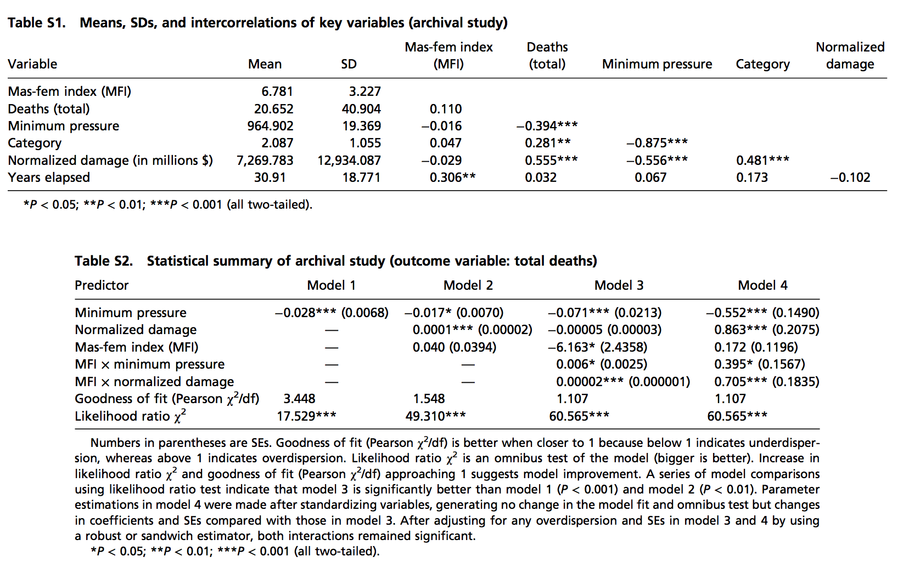

##

Logisitcs:

- homework 4 is open so that we can run lintR; should happen on all pull requests
- Lab on Monday, April 27 will end early so that everyone can attend William Julius Wilson's Tumin Lecture "Reflections on issues of race and class in the 21st century" 4:30pm, 001 Robertson Hall
- classes for the fall; Angela's thoughts on GLM

questions?

##

At the end of this class you will be able to

- explain what you might leanr in a class about the generalized linear model
- think about the hurricane paper

# generalized linear model 

##

All the models that we have seen, and many more are part of one big model family.  GLM has three parts:

- a random component (distribution of residual) (the conditional distribution of the response variable $Y_i$ given the explanatory variables

- a linear predictor $\eta_i = \beta_0 + \beta_1 X_{i1} + \beta_2 X_{i2} + \ldots \beta_k X_{ik}$  

- a link function which transforms the expectation of the response variable to the linear predictor $g(\mu_i) = \eta_i = \beta_0 + \beta_1 X_{i1} + \beta_2 X_{i2} + \ldots \beta_k X_{ik}$

##

outcomes and predictors are combined by a link function

- in multiple regression the link function is the indentity (tricky)

- in logisitic regression the link function is $ln \frac{\mu}{1 - \mu}$

##

kind of legos of models

will allow you to make the kinds of models that you want to combine your outcomes, your predictors, and your ideas about how the world works

##

models with binary outcomes have a special link function, and models with count outcomes also have a special link function

# hurricanes

##

On Monday in lab you will work with the actual hurricane data

##

What is the predicted fatalities for a hurricane with the following characteristics:

- mean minimum pressure
- mean noramlized damage
- most male name possible

What about the same storm with the most female name possible?

##

Hint: They used negative binomial regression and the inforamtion you need is in these tables.




##

```{r}
min_pressure <- 964.902
norm_damage <- 7269.783
mfi <- 1

predicted_deaths <- exp((min_pressure * -0.071) +
                          (norm_damage * -0.00005) +
                          (mfi * -6.163) + 
                          (mfi * min_pressure * 0.006) +
                          (mfi * norm_damage * 0.00002))

print(paste("Predicted deaths:", predicted_deaths))
```

##

```{r}
min_pressure <- 964.902
norm_damage <- 7269.783
mfi <- 11

predicted_deaths <- exp((min_pressure * -0.071) +
                          (norm_damage * -0.00005) +
                          (mfi * -6.163) + 
                          (mfi * min_pressure * 0.006) +
                          (mfi * norm_damage * 0.00002))

print(paste("Predicted deaths:", predicted_deaths))
```

##

Now what happens as you increase normalized damage to two standard deviation above the mean?


```{r}
min_pressure <- 964.902
norm_damage <- 7269.783 + (2 * 12934.087)
mfi <- 1

predicted_deaths <- exp((min_pressure * -0.071) +
                          (norm_damage * -0.00005) +
                          (mfi * -6.163) + 
                          (mfi * min_pressure * 0.006) +
                          (mfi * norm_damage * 0.00002))

print(paste("Predicted deaths:", predicted_deaths))

```

##

I fit the model and found the constant to be 71.28

```{r}
min_pressure <- 964.902
norm_damage <- 7269.783  + (2 * 12934.087)
mfi <- 1
cons <- 71.28

predicted_deaths <- exp(cons +
                          (min_pressure * -0.071) +
                          (norm_damage * -0.00005) +
                          (mfi * -6.163) + 
                          (mfi * min_pressure * 0.006) +
                          (mfi * norm_damage * 0.00002))

print(paste("Predicted deaths:", predicted_deaths))
```

##

I fit the model and found the constant to be 71.28

```{r}
min_pressure <- 964.902
norm_damage <- 7269.783  + (2 * 12934.087)
mfi <- 11
cons <- 71.28

predicted_deaths <- exp(cons +
                          (min_pressure * -0.071) +
                          (norm_damage * -0.00005) +
                          (mfi * -6.163) + 
                          (mfi * min_pressure * 0.006) +
                          (mfi * norm_damage * 0.00002))

print(paste("Predicted deaths:", predicted_deaths))
```


# wrap-up

##

goal check

## 

motivation for next class

##

http://bit.do/soc504_feedback

##


```{r}
sessionInfo()
```
