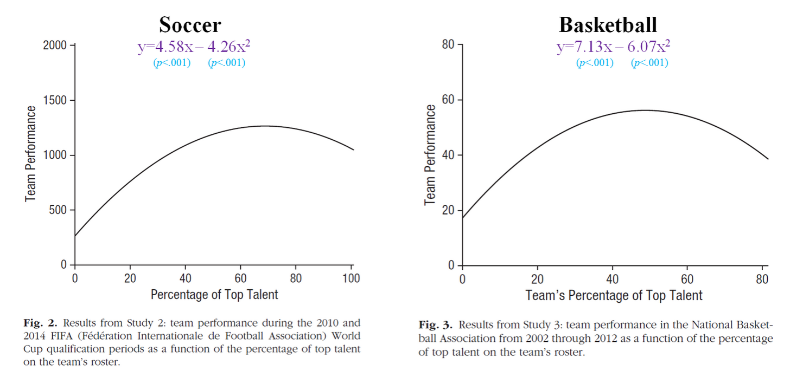
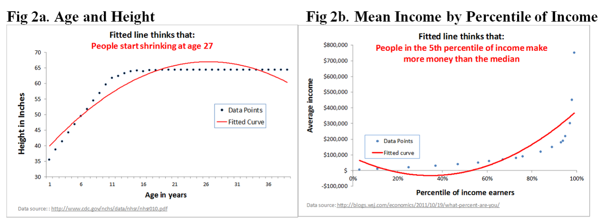

##

Logisitcs:

- experience with lintR?
- Gelman and Hill book
- projects are due Sunday, May 26 at midnight
- you will present your projects to your peers Monday, May in lab

questions?

##

At the end of this class you will be able to

- explain how linear transformations of predictors to aid interpreation of coefficients
- explain how nonlinear transformations of predictors can change improve model fit and fundementally change the model we are using
- explain how to look for u-shaped relationships

# review of GLM

##

All the models that we have seen, and many more are part of one big model family.  GLM has three parts:

- a random component (distribution of residual) (the conditional distribution of the response variable $Y_i$ given the explanatory variables

- a linear predictor $\eta_i = \beta_0 + \beta_1 X_{i1} + \beta_2 X_{i2} + \ldots \beta_k X_{ik}$  

- a link function which transforms the expectation of the response variable to the linear predictor $g(\mu_i) = \eta_i = \beta_0 + \beta_1 X_{i1} + \beta_2 X_{i2} + \ldots \beta_k X_{ik}$

# hypothesis

##

you can figure out a lot using three simple tricks to make the GLM more flexible and interesting

- interactions
- transformation
- U-shaped relationships (a kind of transformation)

# linear transformations

##

centering on the mean or some other convenient point can aid interpreation

##

```{r}
suppressPackageStartupMessages(library(dplyr))
load("data/gapminder.RData")
gapminder <- tbl_df(gapminder)
gapminder
```

##

Hypothesis: The relationship between gdp per capita and life expectancy was different in contries in Asia than other countries in 1952.

$$\widehat{lifeexp}_i = \beta_0 + \beta_1 gdppercap_i + \beta_2 Asia_i + \beta_3 + \beta_3 gdppercap_i * Asia_i$$

Vote: Do you think this is correct?

##

```{r}
data_to_fit <- filter(gapminder, year==1952) %>%
  mutate(asian = (continent=="Asia"))
fit <- lm(lifeExp ~ gdpPercap + asian + gdpPercap:asian, data = data_to_fit)
library(broom)
fit_df <- tidy(fit)
print(fit_df)
```

##

Four questions to do at the board:

- How can we interpret the intercept?
- How can we interpret the cofficient asian?
- How can we interpret the coefficient gdpPercap?
- How can we interpret the interaction coefficent?

##

- *How can we interpret the intercept?*

Predicted life expectancy for a non-Asian country with 0 gdp per captia.

- *How can we interpret the cofficient asian?*

Predicted life expectancy for a Asian country with 0 gdp per capita relative to a non-Asian with 0 gdp per captia.

- *How can we interpret the coefficient gdpPercap?*

Predicted difference in life expectancy between two non-Asian countries that differ by one dollar in gdp per capita (PPP).

- *How can we interpret the interaction coefficent?*

Difference in relationship between gdp per capita and life expectancy for Asian and non-Asian countries.

##

Now let's center the predictors around their means.

```{r}
data_to_fit <- mutate(data_to_fit, gdpPercap_centered = gdpPercap - mean(gdpPercap))
fit_centered <- lm(lifeExp ~ gdpPercap_centered + asian + gdpPercap_centered:asian, data = data_to_fit)
fit_centered_df <- tidy(fit_centered)
print(fit_centered_df)
```

##

Four questions to do at the board:

- How can we interpret the intercept?
- How can we interpret the cofficient asian?
- How can we interpret the coefficient gdpPercap?
- How can we interpret the interaction coefficent?

##

- *How can we interpret the intercept?*

Predicted life expectancy for a non-Asian country with mean gdp per captia (`r mean(data_to_fit$gdpPercap)`).

- *How can we interpret the cofficient asian?*

Predicted life expectancy for a Asian country with mean gdp per capita relative to a non-Asian with mean gdp per captia.

- *How can we interpret the coefficient gdpPercap?*

Predicted difference in life expectancy between two non-Asian countries that differ by one dollar in gdp per capita (PPP).

- *How can we interpret the interaction coefficent?*

Difference in relationship between gdp per capita and life expectancy for Asian and non-Asian countries.

In other words recentering changes in the intercepts not the slopes.

##

What is the predicted life expectancy in Afganistan in 1952 using both models?  Note that you need to know that gdpPercap was 779, mean(gdpPercap) is 3725, and Afghanistan is in Asia.

```{r}
fit_df
fit_centered_df
```

##

Predicted life expectancy in Afghanistan from model without centered predictors is:
```{r}
predictors <- c(1, 779, 1, 779*1)
weights <- fit_df[, "estimate"]
sum(predictors * weights)
```

Predicted life expectancy in Afghanistan from model with centered predictors is:
```{r}
predictors <- c(1, 779 - 3725, 1, ((779 -3725) * 1))
weights <- fit_centered_df[, "estimate"]
sum(predictors * weights)
```

##

- we just saw a linear transformation of predictor to make coefficients more interpretable

- another example is measuring in comfortable units 

##

```{r}
library(ggplot2)
p <- ggplot(data_to_fit, aes(x=gdpPercap, y=lifeExp))
p + geom_point() + geom_smooth() + facet_grid(. ~ asian)
```

##

```{r}
p <- ggplot(data_to_fit, aes(x=gdpPercap, y=lifeExp))
p + geom_point() + geom_smooth(method=lm) + facet_grid(. ~ asian)
```


# nonlinear transformations: logging outcome and predictors

##

Gelman and Hill prefer $log_e$ which they write as log.  I personally prefer $log_{10}$, but let's go with their approach today.


# logging predictor variables

##

Relationship between gdp per capita and life expectancy in 1997 around the world.

```{r}
data <- filter(gapminder, year==1997)
p <- ggplot(data, aes(x=gdpPercap, y=lifeExp))
p + geom_point() + geom_smooth(method=loess)
```

##

```{r}
data <- mutate(data, ln_gdpPercap = log(gdpPercap), base=exp(1))
p <- ggplot(data, aes(x=ln_gdpPercap, y=lifeExp))
p + geom_point() + geom_smooth(method=loess)
```

##

```{r}
model1 <- lm(lifeExp ~ gdpPercap, data = data)
p <- ggplot(augment(model1), aes(x=lifeExp, y=.fitted))
p + geom_point() + coord_equal() +
  expand_limits(x=c(30,80), y=c(30,80)) + geom_abline(intercept = 0, slope = 1)
```

##

```{r}
model2 <- lm(lifeExp ~ ln_gdpPercap, data = data)
p <- ggplot(augment(model2), aes(x=lifeExp, y=.fitted))
p + geom_point() + coord_equal() +
  expand_limits(x=c(30,80), y=c(30,80)) + geom_abline(intercept = 0, slope = 1)
```

##

```{r}
model1 <- lm(lifeExp ~ gdpPercap, data = data)
tidy(model1)
```

```{r}
model2 <- lm(lifeExp ~ ln_gdpPercap, data = data)
tidy(model2)
```

How to interpret the coefficient in model 2?

##

```{r}
p <- ggplot(data, aes(x=ln_gdpPercap, y=lifeExp))
p + geom_point() + geom_smooth(method=lm)
```

##

A country with e times more gdp than another is predicted to have an average life expectancy about 8 years higher.  

## 

Can you think of other things where change in y is related to multiplicative change in x rather than change in x?

Also it is possible to log transform the outcome.  You will see why we focused on transforming the predictor in lab.

# U-shaped relationships


##

talent helps teams, except too much talent hurts teams in sports with high interdependance (basketball and soccer)

##



This is standard approach

##

But, lots of things look u-shaped



##

First plot the data and see if quadratic is reasonable

##

Next, follow their receipe:

- Run the quadratic regression
- Find the point where the resulting u-shape maxes out.
- Now run a linear regression up to that point, and another from that point onwards.
- Test whether the second line is negative and significant.

##

There are fancier things too, but this is a very good robustness check

##

Can you think of other examples where a u-shaped relationship would be interesting?

# wrap-up

##

goal check

## 

motivation for next class

##

http://bit.do/soc504_feedback

##


```{r}
sessionInfo()
```
