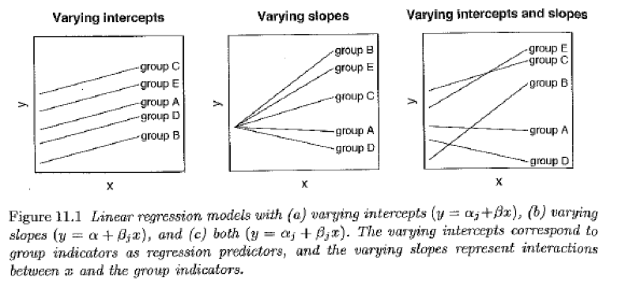
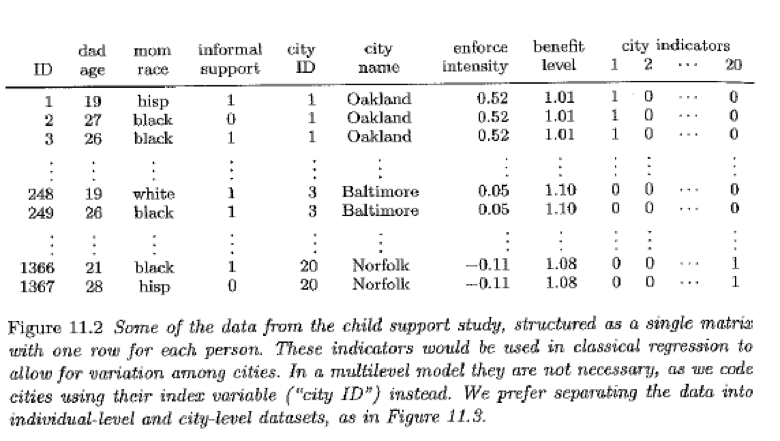
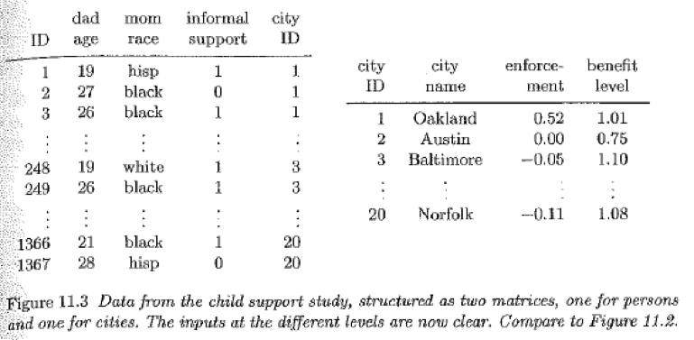
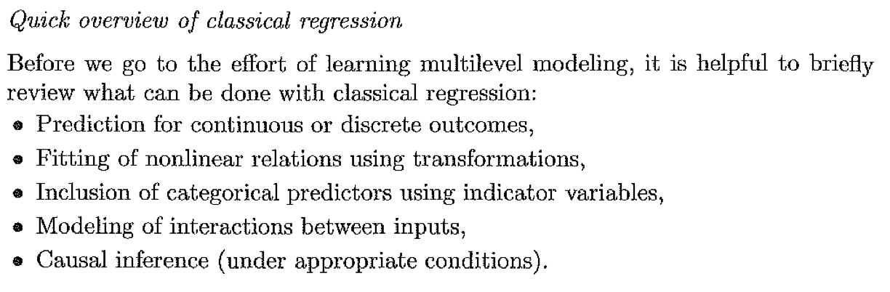
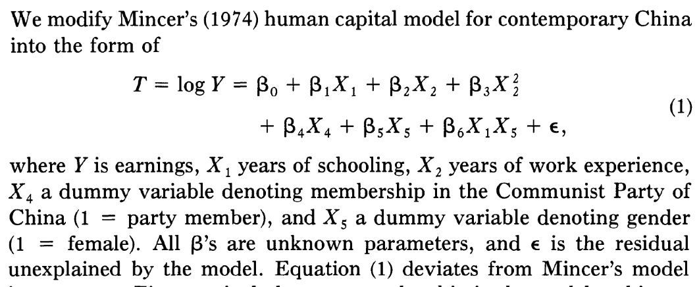
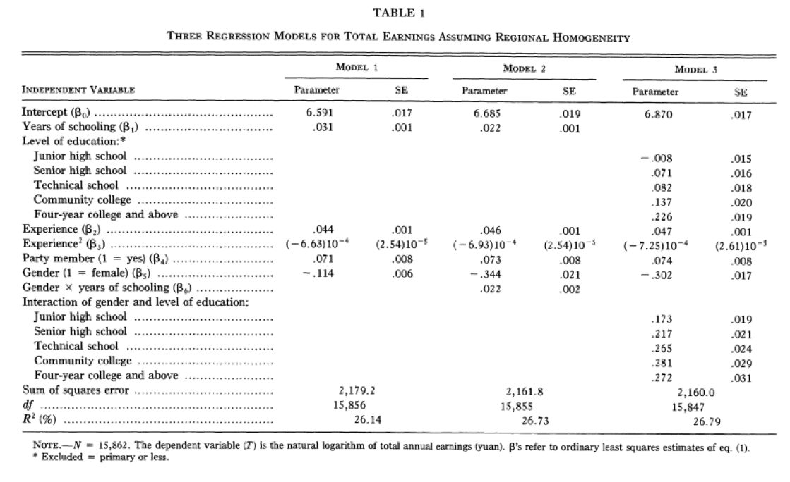
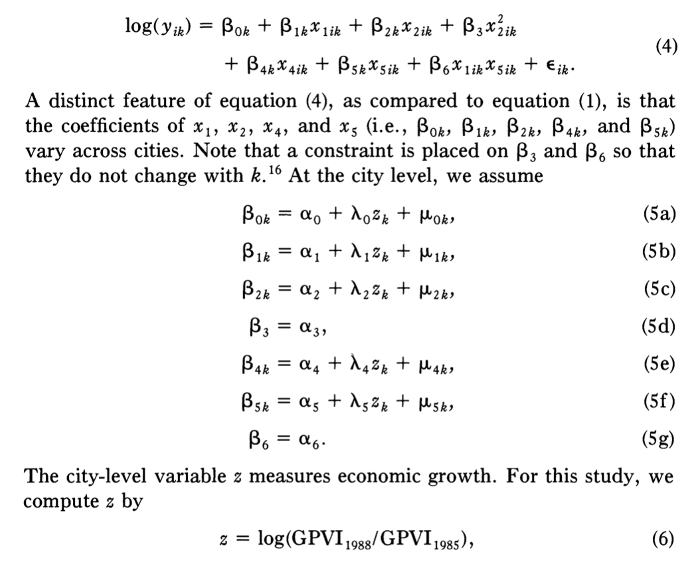
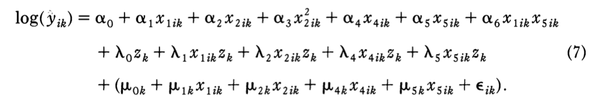
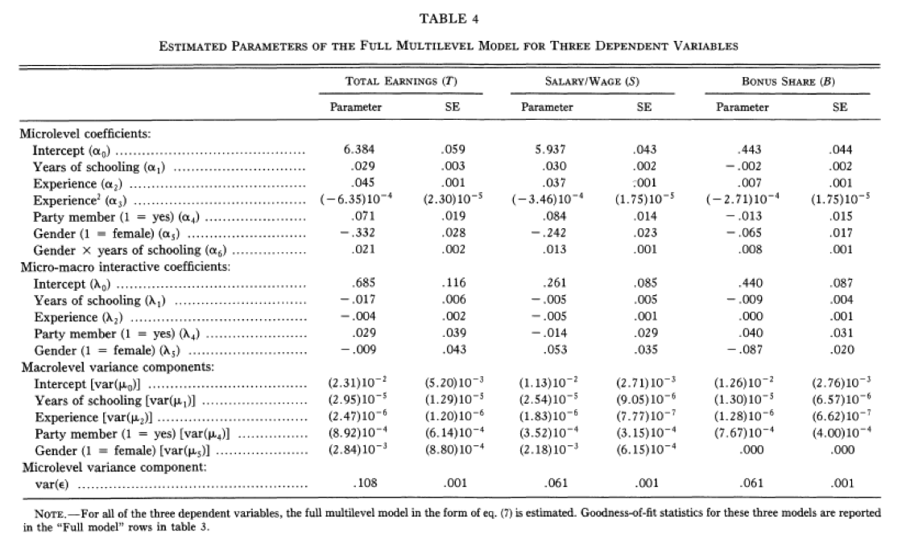

##

Logisitcs:

- science in action
- schedule for Soc 500, what do you recommend?
- Gelman and Hill book
- projects are due Sunday, April 26 at midnight
- you will present your projects to your peers Monday, April 27 in lab

questions?

##

At the end of this class you will be able to

- give examples of sitautions where multilevel models might be appropriate
- reason about a model where the goal is to explore how individual-level patterns vary based on city-level predictors


# multilevel modeling

##

data are structured in groups and the coefficients can vary by group

##



Which model goes with which picture?

1) $y_i = \alpha + \beta_{j[i]}x_i + \epsilon_i$
2) $y_i = \alpha_{j[i]} + \beta_{j[i]}x_i + \epsilon_i$
3) $y_i = \alpha_{j[i]} + \beta x_i + \epsilon_i$

# example

##

How do city level enforcement policies impact rates of child support payments? [using Fragile Families data]

What is the probability that the mother received payments given individual-level predictors, city-level predictors, and the city-level enforcement policy?

##



##



Tidy data!  

##

Four options:

- individual-level model


##

- city-level model


##

- individual-model with city dummies then predict city dummies with city characteristics

##

- all at once

$pr(y_i = 1) = logit^{-1}(X_i \beta + \alpha_{j[i]}) \mbox{ for } i = 1, 2, \ldots n$

$\alpha_j \sim N(U_j \gamma, \sigma_\alpha^2) \mbox{ for } j = 1, 2, \ldots 20$

##

"fixed effects" and "random effects" are used in confusing ways

I think of fixed effects as dummy variables

Gelman and Hill suggest *always* using random effects

##



##

- accounting for individual and group level variation in estimated group-level regression coefficents

- modeling variation amoung individual-lelvel regression coefficients

- estimating regression coefficients for particular groups

# Example

<src img="images/xie_regional_1996_title.png", width=800>

##

Baseline human capital model



##



## 

"According to model 1, the estimated return in earnings to a years of schooling is 3.1%."

$log y_i = b_0 + b_1 X_{i1} + b_2 X_{i2} + \epsilon_i$

$y_i = e^{b_0 + b_1 X_{i1} + b_2 X_{i2} + \epsilon_i}$

$y_i = e^{b_0}  e^{b_1 X_{i1}} e^{b_2 X_{i2}} e^{\epsilon_i}$


```{r}
exp(0.031)
```

Notice how they talk about the actual magnitudes of the coefficients not the stars!

##

Let's look at regional heterogenity!

- fit a model for each city seperately (see appendix)
- or multilevel model

##



##



##

Is economic growth at the city-level positively associated with returns to education?



##

no! $\gamma_1 = -0.017$

##

Next steps: Multilevel models with German 

http://data.princeton.edu/pop510/syllabus.html

# wrap-up

##

goal check

## 

motivation for next class

##

http://bit.do/soc504_feedback

##


```{r}
sessionInfo()
```
