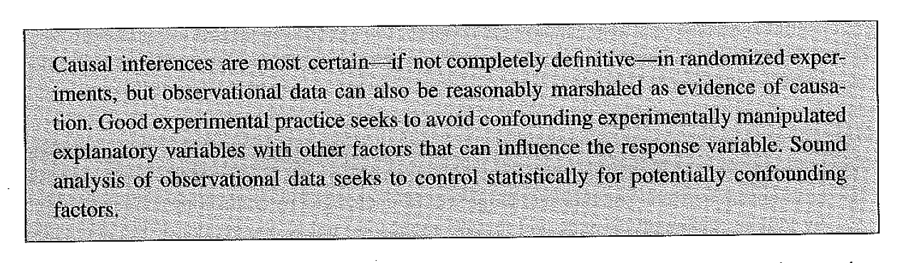
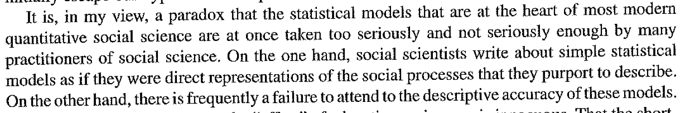

##

Logisitcs:

- feedback due Sunday at midnight
- final changes to replication and extension due Dean's Day Tuesday, May 12 at 5pm (no extensions!)

##

During this class we will reflect on what we have learned and what we can do going forward

# evaluation

## 

By the end of the semester, you will be able to:

- Conduct, interpret, and communicate results from analysis using multiple regression (including dummy variables and interactions).
- Conduct, interpret, and communicate results from analysis using logistic regression (including dummy variables and interactions).
- Describe the relationship between multiple regression, logistic regression, and then generalized linear model.
- Explain the limitations of observational data for making causal claims, and begin to use existing strategies for attempting to make causal claims from observational data.
- Write clean, reusable, and reliable R code.
- Build a solid, reproducible research pipeline to go from raw data to final paper.
- Feel empowered working with data.

##

Further, because we cannot possibly cover everything that you will need to know during your career as a researcher, there are two final long-term goals. After this course is over, you will be able to:

- Learn new statistics
- Learn new programing

# Readings

##

Common themes in Fox, Berk, and Rosenbaum:

humility

# Fox

##



##




# Berk

##

three cheers for descriptive

- advocacy settings where we need the facts
- part of a broader research program
- spotting provactive associations
- and opens to door to machine learning

I often hear people dismisive of "just description" and these same poeple often think that fancy regression is not just description

##

better data beats better models

# Rosenbaum

##

how to get better data: *active observation*, an active search for the rare circumstances in which tangible evidence may be obtained to distinguish treatment effects from most plausible biases

- Effect of minimum wage change in NJ by looking at fastfood on both side of boarder
- Effect of death due to sudden car crash on mental state many years later by having carefully constructed control group (and collecting data about the groups of interest)
- Effect of lead on children looking at parents who worked in factory with lead

##

What is the role of asethetics?  What is beautiful empirical work?

"A beautiful proof is simple, illuminating its conclusion and rendering it obvious.  The same aesthetic applies to evidence.  In both cases simplicitiy only comes from great effort and care."

Making the iPhone simple is hard.

##


- Narrow tests of broad theories: the effect of the change of the 1992 minimum wage law in NJ is not an important even in economic history, but it is important as a test of a theory (he is arguing for strategic research sites)

- Control group: you need to know what would have happened in the absence of treatment

- Sharp treatments that could have happened to anyone

- Competing theories, not null hypothesis test

- Multiple treatment assignment mechanisms (lead study: children could have low levels of lead in three ways: parents did not work in battery factory, parents worked in battery factory but not in lead part, and parents worked in big exposure part but sued good hygiene.  If you see the same outcome for all three groups that is interesting)

##

- non-dose non-response (e.g., Card and Krueger found that restaurants in PA that did not have a change in minimum wage law, did not change hiring practices)

- Stability and sensitivity analysis (stability analysis: how ostensible innocuous changes in analytics decisions change conclusions, sensitivity analysis how changing assumptions changes conclusions)

- Use natural blocks (e.g. siblings)

- Refute several explanations (prepare for the critiques and be ready to refute them)

- Design observational studies and focus on simple comparisons

- What goes wrong in design can't be fixed with fancy statistics

##

Strategic issues:

- strategic issues are more than communication and presentation

- design observation studies

- focus on simple comparisons

- compare subjects who looked similar prior to treatment

- use sensitivity analyses to inform disucssions of hidden biases due to unobserved covariates

# next steps

##


<div class="cite">
https://commons.wikimedia.org/wiki/File:Archives_of_American_Art_-_Willard_Newman_Hirsch_-_2154.jpg
</div>

##

- General linear models with German Rodriguez
- Multilevel models with German Rodriguez
- Survival analysis with German Rodriguez
- Text as data with Brandon Stewart
- others?

# commandments

##

Let's add and consolodate the commandments

# wrap-up

##

Thank you

##


```{r}
sessionInfo()
```
